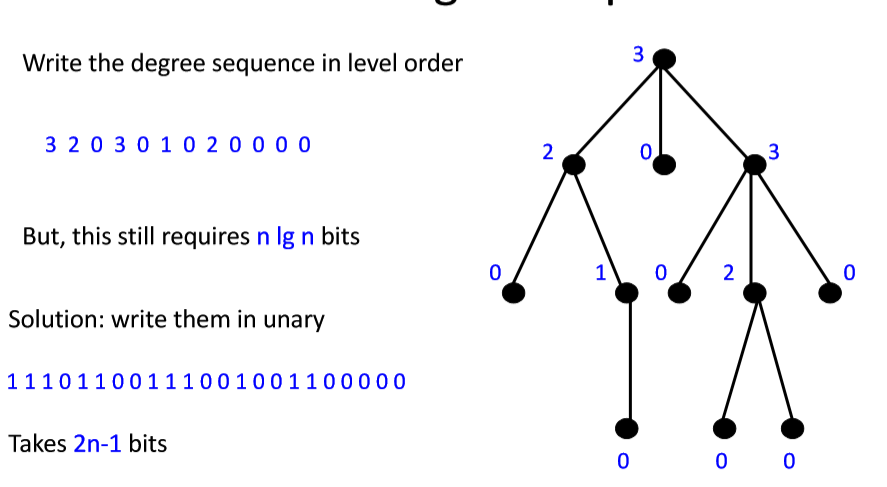

# 平摊分析与基本思路

## Aggregate method （聚集分析）

### Potential Function

$P(i)=amortizedCost(i)-actualCost(i)+P(i-1)$

$\sum(P(i)-P(i-1))=\sum(amortizedCost(i)-actualCost(i))$

$P(n)-P(0)=\sum(amortizedCost(i)-actualCost(i))$

$P(n)-P(0)\geq 0$

When P(0)=0,P(i) is the amount by which the first i operations have been over charged

## Accounting method (记账分析)

Guess that the amortized cost of an increment is 2

Now show that P(m)-P(0) >= 0 is all for m 

1^st^ increment:

* one unit of amortized cost is used to pay for the change in bit 0 from 0 to 1
* the other unit remains as a credit on bit and is used later to pay for the time when bit 0 changes form 1 to 0

n^th^creament

​	…

$P(m)-P(0)=\sum(amotyizedCost(i)-actualCost(i))$

= amount by which the first m increments have been over charged

=number of credits

= number of 1s

$\geq 0$

## Potential method (势能法)

Guess a suitable potential funciton for whtich $P(n)-P(0) \geq 0$ for all n 

Derive amortized cost for i^th^ operation usting $\Delta P = P(i)-P(i-1)=amortizedCost  - actualCost$

$amortizedCost  = acutalCost + \Delta P$

# 数据结构、二叉树与树

* Arbitrary Ordered Trees

  *  Use parenthesis notation to represent the tree

  *  As the binary string(((())())((())()())): traverse tree as “(“ for node, then subtrees, then “)” 

  * 2 Bits per node

    

    

* Heap-like notation

  

  

* Orded threes

  * parent
  * first child
  * next sibling
  * degree
  * subtree size

* Level-order degree sequence

  

  

# 外排序

## 缓冲使用策略，原因和方法

# 红黑树

# 最小最大堆

# 设计数据结构与算法

