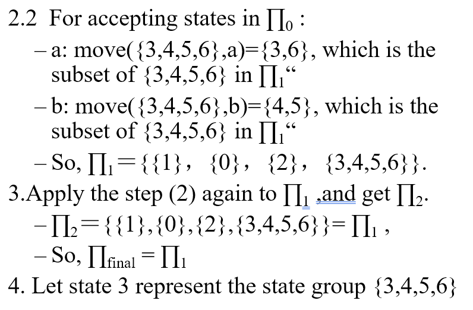
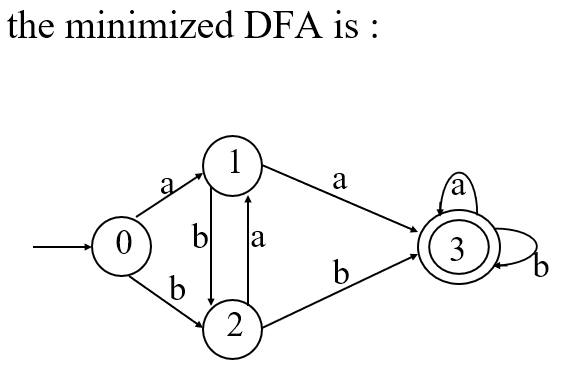
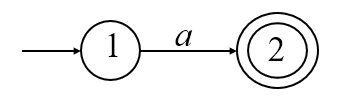

[TOC]
# Chapter 1

>   None

# Chapter 2 Language & Syntax Description

## Language & syntax description

>   1.  Alphabet
>
>     Non-empty set of symbols，usually expressed in $\Sigma$、$V$ or Other Upper-case Greece Letter
>
>   2.  Symbol (Character)
>
>     Elements in alphabet, finest elements in a language
>
>   3.  String
>
>     Finite sequence of symbols in the Alphabet.
>
>     Notes: Null-string is string without any symbol, written as e。
>
>   > 1. A = {$\alpha_1$,$\alpha_2$,…} B ={$\beta_1$,$\beta_2$}
>   >
>   >    AB = $\{\alpha\beta|\alpha\in A\ and\ \beta \in B\}$
>   >
>   >    $A^0=\{\varepsilon\}$
>   >
>   > 2. Closure
>   >
>   >    $A^*=A^0\cup A^1\cup A^2...$
>   >
>   > 3. Positive closure
>   >
>   >    $A^+=A^1\cup A^2 \cup A^3...$
>
>   4.  Sentence
>
>      A set of strings based on symbols in the Alphabet in  certain construction rules
>
>   5.  Language
>
>      Sets of sentences in the Alphabet.
>
>      Notes: By convention, a symbol is expressed as a,b,c,…；a string is expressed as $\alpha$,$\beta$,$\gamma$…；a set of strings is expressed in A,B,C….

* Grammar
  * Grammar(G)
  * None-terminal symbol($V_N$)
  * Terminal symbol($V_T$)
  * Start symbol(S)
  * Production(P)
    * <Sentence>→<subject><Predicate>
    * $A\rightarrow \alpha$
  * Derivation(Leftmost & Rightmost)
  * Reduction
  * Sentential form,  Sentence & Language
  * Recursive definition of grammar rules
  * Extended notations of grammar rules
* Formal definition
  * Grammar
    * **quadruple** ($V_N,V_T,P,S$)
  * Catalog of grammars
    * 0-type grammar (Phrase grammar or grammar without limitation)
      * to any production $\alpha\rightarrow\beta$ in P $(\alpha\in V^+,\beta\in V^*)$ ,there is at least  a non-terminal symbol in $\alpha$
    * 1-type grammar (context-sensitive grammar or length-added grammar)
      * to any production $\alpha\rightarrow\beta$ in P, there is the limitation of $|\beta|\ge|\alpha|$ **expect for $S\rightarrow\varepsilon$,if $S\rightarrow\varepsilon$, S can not appear in the right side for any production.
      * for any production $\alpha\rightarrow\beta$ in P, $\alpha A\beta\rightarrow\alpha\gamma\beta\ (\alpha,\beta\in V^*)$ expect for $S\rightarrow\varepsilon$
    * 2-type grammar (context-free grammar)
      * Every production in P is of the form $A\rightarrow\beta$ where $A\in V_N,\beta\in V^*$
    * 3-type grammar (Regular grammar, right-linear grammar or left-linear grammar)
      * Every production in P is of the form $A\rightarrow\alpha B,A\rightarrow\alpha$, or $A\rightarrow B\alpha$,$A\rightarrow\alpha$,where $A$,$B\in V_N,\alpha\in V_T^*$
* Grammar Simplification
  * delete productions like $P\rightarrow P$
  * delete productions who can not be used in the derivations
  * delete productions who can not derive a terminal string
* Construct context-free grammar without ε-production
  * it should follow conditions as followings
    * If there is the production S→ε of the form in P, S should not appear in right-side of any production, where S is the start symbol of the grammar;
    * There are no other ε-productions in P
  * How to construct
    * $G=(V_N,V_T,P,S)\rightarrow G'=(V'_N,V'_T,P',S')$
    * find out all non-terminal symbols that can derive ε after some steps, and put them into the set $V_0$
    *   construct the P’s set of productions of G’ as following steps:
      1. If an symbol in $V_0$ appears in the right side of a production, change the production into two production respectively; put the new productions into P
      2. put the productions relating to the symbol into P’ except for ε-production relating to the symbol
      3. if there exists the production of the form $S\rightarrow \varepsilon$ in P,change the production into $S’\rightarrow \varepsilon |S$ and put them into  $P’$,let $S’$ be the start symbol of $G’$, let $V’_N=V_N\cup \{S'\}$
* Syntax tree and ambiguity of a grammar
  * Basic terms in a syntax tree
    * Sub-tree
    * Pruning sub-tree
    * Sentential form

# Chapter 3 Lexical analysis

## Approaches to implement a lexical analyzer

* Simple approach

  * Construct a diagram that illustrates the structure of the tokens of the source language , and then to hand-translate the diagram into a program for finding tokens

    >  Efficient lexical analyzers can be produced in this manner

* Pattern-directed programming approach

  * Pattern Matching technique

  * Specify and design program that execute actions triggered by patterns in strings

  * Introduce a pattern-action language called Lex for specifying lexical analyzers

    - Patterns are specified by regular expressions
- A compiler for Lex can generate an efficient finite automation recognizer for the regular expressions

## The role of the lexical analyzer

* First phase of a compiler

  1. Main task

     * To read the input characters 
     * To produce a sequence of tokens used by the parser for syntax analysis
     * As an assistant of parser

  2. Interaction of lexical analyzer with parser

     

     

3. 、Processes in lexical analyzers

   *　Scanning
     *　Pre-processing
       * Strip out comments and white space
       * Macro functions
   *　Correlating error messages from compiler with source program
     *　A line number can be associated with an error message
   *　Lexical analysis

4. Terms of the lexical analyzer

   1. Token 
      * Types of words in source program
      * Keywords, operators, identifiers, constants, literal strings, punctuation symbols(such as commas,semicolons)
   2. Lexeme
      1. Actual words in source program
   3. Pattern
      1. A rule describing the set of lexemes that can represent a particular token in source program
      2. **Relation** {<.<=,>,>=,==,<>}

5. Attributes for Token

   1. A pointer to the symbol-table entry in which the information about the token is kept

   >  E.g E=M*C**2

    <**id**, pointer to symbol-table entry for E>

    <**assign_op**,>

   <**id**, pointer to symbol-table entry for M>

   <**multi_op**,>

   <**id**, pointer to symbol-table entry for C>

   <**exp_op**,>

   <**num**,integer value 2>
   
6. Lexical Errors

    *   Deleting an extraneous character
    *   Inserting a missing character
    *   Replacing an incorrect character by a correct character
    *   Transposing two adjacent characters(such as , fi=>if)
    *   Pre-scanning 

7.  Input Buffering
    *   Two-buffer input scheme to look ahead on the input and identify tokens
    *   Buffer pairs
    *   Sentinels(Guards)

## Specification of tokens

1. Regular definition of tokens
   1. regular expression (RE)
2. regular language`L(r)`
3. rule of regular expression over alphabet $\Sigma$
   1. $\varepsilon \rightarrow \{\varepsilon \}$
   2. $\alpha|\beta$
   3. $\alpha \beta$
   4. $\alpha*$
   5. $\alpha+$
   6. $\alpha ?$
   7. $[a-z]$

## Recognition of tokens

1. task of recognition of token in a lexical analyzer

   1. Isolate the lexeme for the next token in the input buffer

   2. produce output pair like <id,pointer to table entry>

      >A example translation table
      >
      >| RE   | Token | Attribute-value        |
      >| ---- | ----- | ---------------------- |
      >| if   | if    | -                      |
      >| id   | id    | Pointer to table entry |
      >| <    | relop | LT                     |

   3.  method to recognition of token

      * Transition diagram(Stylized flowchart)

        

        * each state gets a segment of code
        * use nextchar() to read a character and move to next state

2. FA ( Finite Automation )

   1. Deterministic or non-deterministic FA

      1. ＮFA contains more than one transition out of a state may possible on the same input symbol while DFA not.

   2. DFA

      1. quintuple $M(S,\Sigma,move,s_0,F)$

         * $S$: a set of states

         * $\Sigma$: the input symbol alphabet

         * $move$: a transition function, mapping from $S\times \Sigma$ to $S$, $move(s,a)=S’$

         * $s_0$: the start state

         * $F$: a set of states $F$ distinguished as accepting states

           > $F\subseteq S,s_0 \in S$

      2. note

         1. no state has an $\varepsilon$
         2. for each state s and input symbol a, there is at most one edge labeled a leaving s
         3. transition graph are used to describe a FA
         4. A DFA accepts an input string x if and only if there is some path in the transition graph from start state to some accepting state

   3. NFA

      1. quintuple $M(S,\Sigma,move,s_0,F)$

         * $S$: a set of states

         * $\Sigma$: the input symbol alphabet

         * $move$: a transition function, mapping from $S\times \Sigma$ to $S$, $move(s,a)=2^S$

         * $s_0$: the start state

         * $F$: a set of states $F$ distinguished as accepting states

           > $2^S\subseteq S, F\subseteq S,s_0 \in S$

      2. note

         1. $\epsilon$ is a legal input symbol

   4. Convert of an NFA to a DFA

      >  avoid ambiguity

      * Obtain ε-closure(T)

      * push all states in T onto stack

      * initialize ε-closure(T) to T;

        > while stack is not empty do{
        >
        > ​	pop the top element of the stack into t;
        >
        > ​	for each state u with an edge from t to u labeled ε do{
        >
        > ​		if u is not in ε-closure(T){
        >
        > ​			add u to ε-closure(T)
        >
        > ​			push u into stack
        >
        > ​		}
        >
        > ​	}
        >
        > }

      * Input
        
      * 	NFA $N = (S,\Sigma,move,S_0,Z)$
        
      *   Output
      
          * 	DFA $D = (Q,\Sigma,\delta,I_0,F)$
      
      *   Subset construciton
      
        1. $I_0 = \epsilon-clousure(S_0),I_0\in Q$
        2.
        $$
        foreach\ I_i,I_i \in Q \
        \ let I_t = \epsilon-clousure(move(I_i,a) \
        \ if\ I_t\notin Q\ then\ put\ I_t\ into Q
        $$

        3. repeat step2 until there is no new state to put into $Q$
        
        4. $let F = \{I|I\in Q,I \cap Z<>\Phi\}$
        
           
        
           
   
   3. minimizing the number of states of a DNA
   
      * Input
   
        * DFA $M = \{S,\Sigma,move,s_0,F\}$
   
      * Output
   
        * DFA $M'$ accepting the same language as M and having as few states as possible
   
      * Algorithm
   
        1. Construct an initial partition ∏ of the set of states with two groups: the accepting states *F* and the non-accepting states *S-F.* ∏0＝{I01,I02}
        2. For each group *I* of *∏**i* ,partition *I* into subgroups such that two states *s* and *t* of *I* are in the same subgroup if and only if for all input symbols *a*, states *s* and *t* have transitions on *a* to states in the same group of *∏**i* ; replace *I* in *∏**i+1_*by the set of subgroups formed.
        3. If *∏**i+1* =*∏**i* ,let *∏**final* =*∏**i+1* and continue with step (4). Otherwise,repeat step (2) with *∏**i+1* 
        4. Choose one state in each group of the partition *∏**final* as the representative for that group. The representatives will be the states of the reduced DFA M’. Let *s* and *t* be representative states for *s*’s and *t*’s group respectively, and suppose on input *a* there is a transition of *M* from *s* to *t*. Then *M’* has a transition from *s* to *t* on *a*.
        5. If M’ has a dead state(a state that is not accepting and that has transitions to itself on all input symbols),then remove it. Also remove any states not reachable from the start state.
   
        
   
        
   
        
   
        
   
   4. RE to NFA
   
      * Method
        * Parse r into its constituent sub-expressions
        * ε
          * 
        * $a\in \Sigma$
          * 
        * 
   
   5. FA to RE
   
   6. Regular Grammar to NFA (Right linear grammar to FA)
   
      * Input $G = (V_N,V_T,P,S)$
   
      * Output FA $M = (Q,\Sigma,move,q_0,Z)$
   
      * Method
   
        * Consider each non-terminal symbol in G as a state, and add a new state T as an accepting state.
        * Let $Q=V_N\cup\{T\} , S ＝ V_T , q_0 ＝S$; if there is the production $S\rightarrow \varepsilon$, then $Z=\{S,T\}, else Z=\{T\}$ 
        * For the productions similar as A1 → aA2，construct move(A1,a)= A2
        * For the productions similar as A1 → a, construct move(A1,a)= T
        * For each *a* in Σ, move(T,a)=ψ, that means the accepting states do not recognize any terminal symbol.
   
        
   
        
   
   7. FA to Right-linear grammar
   
      * Input $M=(S,\Sigma,f,s_0,Z)$
   
      * Output $R_g = (V_N,V_T,P,s_0)$
   
      * Method
   
        * if $s_0\notin Z$
   
          * For the mapping $f(A_i,a)=A_j$ in M $A_i\rightarrow aA_j$
   
        * if $s_0\in Z$
   
          * add a new production $A_i\rightarrow a$,$A_i=\rightarrow a|aA_j$
   
            

🚧under construction🚧

