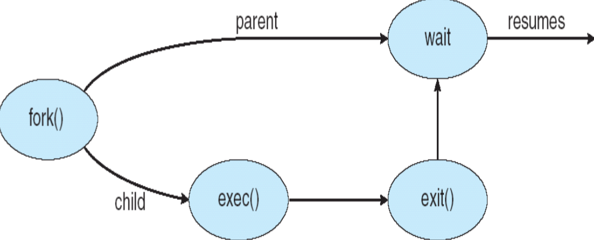
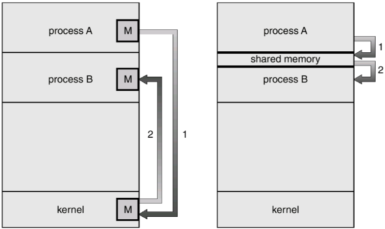
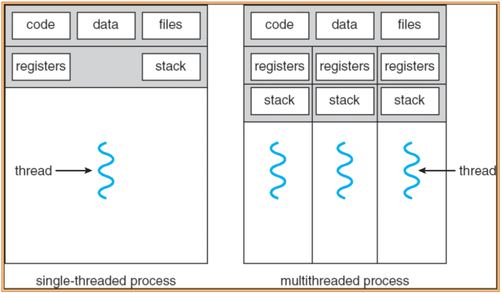
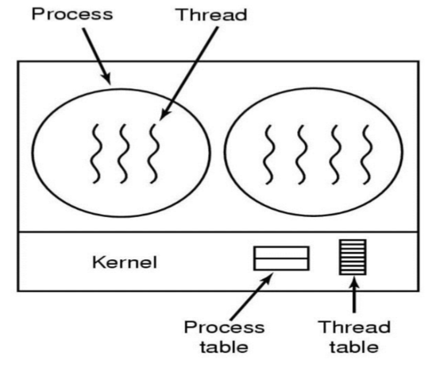
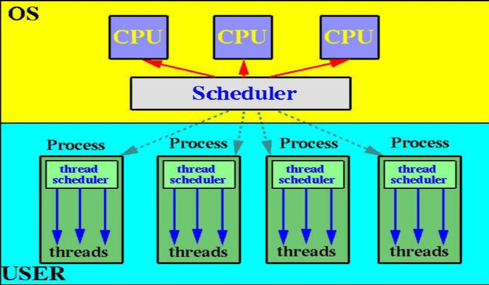
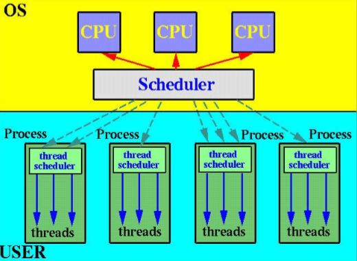

[TOC]

# Chapter 1 Introduction

* System view
	* Resource allocator
	* Control program

* Dual-Mode Operation
	* User mode
	* Kernel mode
		*   privileged instruction
		*   
		*   
	* Hardware
	* **CPU protection**
		*   **timer**
		    *   **time sharing**
	* **memory protection**
		*   **Base register**
		*   **Limit register**
	* **I/O protection**
		*   **all I/O instruction are privilege instructions**

* Development of OS
	*   mainframe systems

		*   NO OS
		*   **batch systems**
		*   **multiprogramming systems**
		*   **time sharing systems**

	*   desktop systems

	*   multiprocessor systems

	*   distributed systems

	*   clustered systems

	*   real-time systems

	*   handheld systems

	*   现代操作系统的特征

		*   **并发性Concurrence**
		*   **共享性Sharing**
		*   **虚拟性Virtual**
		*   **异步性Asynchronism**
		*   提高CPU利用率，充分发挥并发性：**程序之间、设备之间、设备与CPU之间**均**并发工作**

	*   Pr：

		批处理系统、多道程序系统和分时系统的技术特性

# Chapter 2 Operating-System Structures

*   功能和服务的差别：
    *   对内：自行实现
    *   对外：可以调用其他功能代为实现
*   common function of OS
    *   process management
        *   process synchronization
        *   process communication
        *   deadlock handling
        *   (分布式)
    *   main memory management
    *   secondary-storage management
    *   file management
    *   I/O system management
*   Operating System Services(Services for **helping users**)
    *   Program execution
    *   I/O operations
    *   File-system manipulation
    *   Communications
    *   Error detection
    *   Resource allocation
    *   Accounting(审计)
    *   Protection
*   Operating System Interface
    *   Interface to programs
        *   **System calls**
            *   System-call interface(SCI)
            *   Application Programming Interface(API)
                *   managed by runtime support library
        *   
        *   
            *   Types of System calls
                *   Process control
                *   File management
                *   Device management
                *   Information maintenance
                *   Communications
    *   **PR. Why do user use APIs rather than system calls directory?**
    *   **ANS.**
        1.  跨平台能力（提供相同的API封装）移植性好
        2.  模块化封装，可维护性好
        3.  简化了程序编写
        4.  提高了执行效率
*   Operating System Structure
    *   Simple structure
    *   Layered structure
        *   virtual machines
    *   Microkernel structure
        *   Benefis
            *   easier to extend
            *   easier to port
            *   more reliable
            *   more secure
    *   Modules
    *   PR:设计操作系统时采用的模块化内核方法和分层方法在那些方面类似？那些方面不同？
*   Operating system design and implementation
*   小结
    *   操作系统概念（管理资源、支持程序运行、方便用户使用的**程序集**）
    *   操作系统的基本目标：**方便性和高效性**
    *   引导程序：**中断、中断处理程序、中断向量**
    *   储存结构：内存（**小、易失**）二级储存（**大、非易失**）、分层结构
    *   I/O结构：设备控制器（本地缓冲）、DMA
    *   硬件保护：**双重模式操作、特权指令、I/O保护、内存保护、CPU保护**
    *   操作系统的发展：e.g: 多道程序设计
    *   操作系统的功能：进程（CPU）管理、内存管理、磁盘管理、文件管理、I/O管理、**用户接口**
    *   操作系统服务：**程序执行、I/O操作、文件系统操作、通信、错误检测与处理**、资源分配、统计、保护
    *   操作系统接口：用户接口（CLI、GUI）、程序接口（**系统调用（参数传递、类型）**）、SCI、API
    *   操作系统结构

# Chapter 3 Process

*   Process 

	*   test section(program code)
	*   **program counter**
	*   **contents of the processer's registers**
	*   Heap-stack
	*   data section
	*   
	*   
	*   **Characteristic of process**
	    *   **Dynamic动态性**
	    *   **Independency独立性**
	    *   **Concurrence并发性**
	    *   **Structure结构化**
	*   PR.进程和程序是两个密切相关的概念，请阐述他们之间的区别和联系
	*   Process state
	*   
	*   
	*   Process control block(PCB)
	*   
	*   

*   Process scheduling queues

	*   Job queue (in main memory)
	    *   Ready queue 
	    *   device queues
	        *   process migration between the various queues
	        *   
	        *   
	        *   
	        *   
	    *   Schedulers
	        *   Long-term scheduler(秒级、分钟级，作业调度)
	        *   Short-term scheduler(毫秒级，CPU调度)
	        *   Medium-term scheduler(swapping)
	    *   I/O bound process
	    *   CPU bound process
	    *   Context switch
	        *   The **context** of a process is represented in **PCB** of the process and includes the values of CPU registers.
	        *   保存执行后的上下文信息
	        *   上下文切换会带来开销
	        *   尽量减少上下文切换以减少开销
	        *   
	        *   

*   Operation on Process

	*   Process creation

		*   child process(unique process identifier(int)), tree of process

		*   resource sharing

			*   parent and children shall all resources
			*   children share subset of parent’s resources
			*   parent and child share no resources

		*   Execution

			*   Parent and children execute concurrently
			*   Parent waits until children terminate

		*   Address space

			*   child duplicate of parent

			*   child has a program loaded into it (new text section)

			*   UNIX examples

				*   fork() :create new process

				*   exec() :used after a fork to replace the process’s memory space with a new program

					

				*   

				*   ``` c++
					pid = fork();
					if(pid<0)	/* error occured */
					{
					    printf(stderr,"Fork failed");
					    exit(-1);
					}
					else if(pid==0)	/* child process */
					{
					    execlp("/bin/ls","ls",NULL);
					}
					else	/* parent process */
					{
					    wait(NULL);	/* wait for child process to finish */
					    printf("Child complete");
					    exit(0);
					}
					```

			*   Process Termination

				*   exit()  process executes last statement and asks the operating system to delete it
				    *   output data from child to parent (via wait)
				    *   Process’s resources are deallocated by OS
				*   abort()  parent may terminate execution of children process
				    *   child has exceeded allocated resources
				    *   task assigned to child is no longer required
				    *   parent is exiting <small>^*^not all of the operation system supports **Cascading termination(级联终止)**</small>

*   InterProcess Communication(**IPC**)

	*   **Independent** process cannot affect or be effected by the execution of another process

	*   **Cooperating** process can affect or be effected by the execution of another process

		*   Advantages

			1. Information sharing

			2. Computation speed-up

			3. Modularity

			4. Convenience

	*   **Shared memory** & **Message passing**

		

		

		- Shared-memory Systems

			- requiring communication process to establish a region of shared memory
			- a shared memory region resides in the address space of the process creating the shared memory segment
			- the processes are responsible for ensuring that they are not writing to the **same location simultaneously**
				- Producer-Consumer Problem

		- Message-passing Systems

			- MPS has two operations

				- send()
				- receive()

			- communication link

				1. link may be unidirectional or bidirectional 

				2. a link may be associated with many processes

				- direct communication

					- send(P,message) send a message to process P
					- receive(Q,message)  receive a message from process Q

				- indirect communiction

					- mailboxes

						- each mailbox has a unique id

						- two processes can communicate only if the share a mailbox

						- Operations

							> 1. create a new mailbox
							> 2. send and receive messages through mailbox
							> 3. destroy a mail box

		- Synchronization

			- Blocking: synchronous
			- Non-blocking: asynchronous

		- Buffering

			- **Zero capacity** sender must wait for receiver
			- **Bounded capacity** finite length of $n$ messages, sender must wait if link full
			- **Unbounded capacity** infinite length, sender never blocks

*   Communication in Client-Server System

	*   **Sockets**
	*   **Remote Procedure Calls**
	*   **Remote Method Invocation (Java)**

# Chapter 4 Threads

- Multithreading Models

  - A thread is a flow of control within a process

  - thread is a **basic** unit of CPU execution (known as LightWeight Process(LWP))

  - process (HeavyWeight process(HWP)) has a **single** thread of control

  - multithreaded process contains several **different** flows of control within the **same** address space

  - Thread

    - has

      - thread ID
      - program counter
      - register set
      - stack

    - share

      - code section

      - data section

      - other OS resources(file and signals)

      	

      	

      - Benefits

      	- responsiveness
      	- resource sharing
      	- economy(low cost in overhead of creating and context-switch)
      	- Utilization of multiprocessor architectures

    - User Threads

      - user threads are supported above the kernel. The kernel is **not** aware of user threads

      - Library provides all support for thread creation, termination, joining and scheduling

      - more efficient(no kernel intervention)

      - if one thread is blocked, every other threads of the same process are also blocked(containing process is blocked)

        

        

      - Kernel Threads

        - kernel threads are usually **slower** than the user threads

        - blocking one thread will **not** cause other threads of the same process to block

        - the kernel can schedule threads on different processors(in a multiprocessor environment)

          

          

          **Pr.**

          1. 进程和线程之间的区别和联系
          2. 用户级线程和内核级线程的区别

    - Multithreading models

        - many to one 

            - only one thread in the one process can access the kernel at a time
            - true concurrency is not gained

            

            

        - one to one

            - each user-level thread maps to kernel thread

            - providing more concurrency

            - restricting the number of threads supported by the system

                

                

        - many to many

            - allow many user level threads to be mapped to many kernel threads

                

                

- Thread Libraries

	- status
	- 

	``` C++
	int pthread_create(tid,attr,function,arg);
	/*
	 * pthread_t *tid
	 	handle of created thread
	 * const pthread_attr_t *attr
	 	attribes of thread to be created
	 * void *(*function)(void)
	 	function to be mapped to thread
	 * void * arg
	 	single argument to function
	 */
	int pthread_join(tid,val_ptr);
	/*
	 * pthread_t *tid
	 	handle of joinable thread
	 * void ** var_ptr
	 	exit value rturn by joined thread
	 */
	void pthread_exit(void *status);
	int pthread_cancel(pthread_t thread);	//terminated immediately
	int pthread_kill(pthread_t thread,int sig);
	```

	- CreateThread
	- GetCurrentThreadId
	- GetCurrentThread
	- SuspendThread/ResumeTread
	- ExitThread
	- TerminateThread
	- GetExitCodeThread
	- GetThreadTimes

- Threading Issues

- Operating System Examples

- //TODO 关于线程的实现

- **Pr.**

	- 信号机制和中断机制的异同

- Thread Pools

	- advantages
		- faster to service a request(save the time to create new thread)
		- allow the number of threads in the application to be bound to the size of the pool

- Thread specific data

	- threads belonging to a process share the data of the process
	- allows each thread to have its own copy of data
	- when using a thread pool, each thread may be assigned a unique identifier

- Scheduler activations

- **upcalls**

🚧正在施工中……🚧


​		