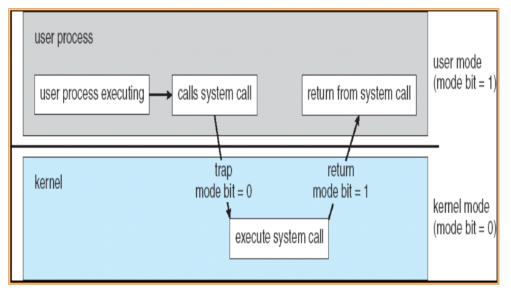

# Chapter0

# Chapter1Introduction

### System view

*   Resource allocator
*   Control program

### Dual-Mode Operation

*   User mode
*   Kernel mode
    *   privileged instruction
    *   
*   Hardware
*   **CPU protection**
    *   **timer**
        *   **time sharing**
*   **memory protection**
    *   **Base register**
    *   **Limit register**
*   **I/O protection**
    *   **all I/O instruction are privilege instructions**

### Development of OS

*   mainframe systems

    *   NO OS
    *   **batch systems**
    *   **multiprogramming systems**
    *   **time sharing systems**

*   desktop systems

*   multiprocessor systems

*   distributed systems

*   clustered systems

*   real-time systems

*   handheld systems

*   现代操作系统的特征

    *   **并发性Concurrence**
    *   **共享性Sharing**
    *   **虚拟性Virtual**
    *   **异步性Asynchronism**
    *   提高CPU利用率，充分发挥并发性：**程序之间、设备之间、设备与CPU之间**均**并发工作**

*   Pr：

    批处理系统、多道程序系统和分时系统的技术特性

## Chapter2 Operating-System Structures

*   功能和服务的差别：
    *   对内：自行实现
    *   对外：可以调用其他功能代为实现
*   common function of OS
    *   process management
        *   process synchronization
        *   process communication
        *   deadlock handling
        *   (分布式)
    *   main memory management
    *   secondary-storage management
    *   file management
    *   I/O system management
*   Operating System Services
    *   Program execution
    *   I/O operations
    *   File-system manipulation
    *