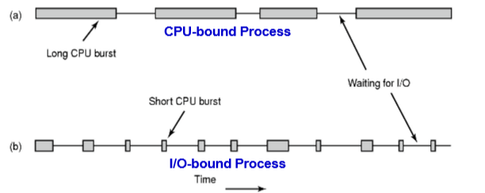
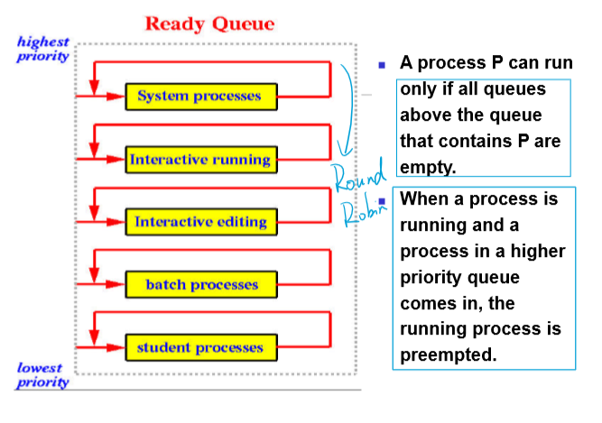
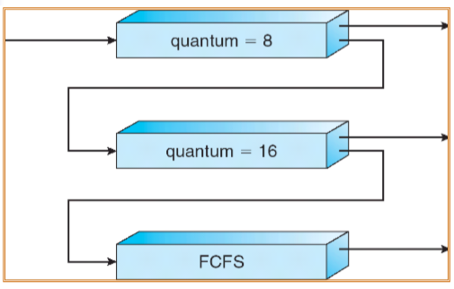
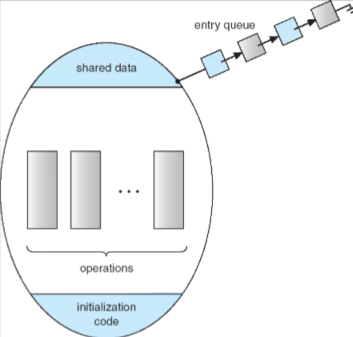
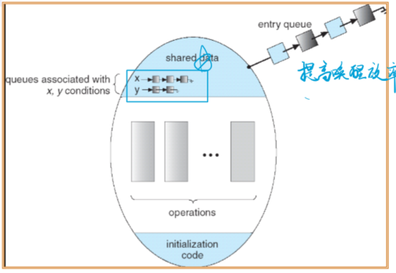

[TOC]

# Chapter 1 Introduction

* System view
	* Resource allocator
	* Control program

* Dual-Mode Operation
	* User mode
	* Kernel mode
		*   privileged instruction
		*   
		*   
	* Hardware
	* **CPU protection**
		*   **timer**
		    *   **time sharing**
	* **memory protection**
		*   **Base register**
		*   **Limit register**
	* **I/O protection**
		*   **all I/O instruction are privilege instructions**

* Development of OS
	*   mainframe systems

		*   NO OS
		*   **batch systems**
		*   **multiprogramming systems**
		*   **time sharing systems**

	*   desktop systems

	*   multiprocessor systems

	*   distributed systems

	*   clustered systems

	*   real-time systems

	*   handheld systems

	*   现代操作系统的特征

		*   **并发性Concurrence**
		*   **共享性Sharing**
		*   **虚拟性Virtual**
		*   **异步性Asynchronism**
		*   提高CPU利用率，充分发挥并发性：**程序之间、设备之间、设备与CPU之间**均**并发**

	*   Pr：

		批处理系统、多道程序系统和分时系统的技术特性

# Chapter 2 Operating-System Structures

*   功能和服务的差别：
    *   对内：自行实现
    *   对外：可以调用其他功能代为实现
*   common function of OS
    *   process management
        *   process synchronization
        *   process communication
        *   deadlock handling
        *   (分布式)
    *   main memory management
    *   secondary-storage management
    *   file management
    *   I/O system management
*   Operating System Services(Services for **helping users**)
    *   Program execution
    *   I/O operations
    *   File-system manipulation
    *   Communications
    *   Error detection
    *   Resource allocation
    *   Accounting(审计)
    *   Protection
*   Operating System Interface
    *   Interface to programs
        *   **System calls**
            *   System-call interface(SCI)
            *   Application Programming Interface(API)
                *   managed by runtime support library
        *   
        *   
            *   Types of System calls
                *   Process control
                *   File management
                *   Device management
                *   Information maintenance
                *   Communications
    *   **PR. Why do user use APIs rather than system calls directory?**
    *   **ANS.**
        1.  跨平台能力（提供相同的API封装）移植性好
        2.  模块化封装，可维护性好
        3.  简化了程序编写
        4.  提高了执行效率
*   Operating System Structure
    *   Simple structure
    *   Layered structure
        *   virtual machines
    *   Microkernel structure
        *   Benefis
            *   easier to extend
            *   easier to port
            *   more reliable
            *   more secure
    *   Modules
    *   PR:设计操作系统时采用的模块化内核方法和分层方法在那些方面类似？那些方面不同？
*   Operating system design and implementation
*   小结
    *   操作系统概念（管理资源、支持程序运行、方便用户使用的**程序集**）
    *   操作系统的基本目标：**方便性和高效性**
    *   引导程序：**中断、中断处理程序、中断向量**
    *   储存结构：内存（**小、易失**）二级储存（**大、非易失**）、分层结构
    *   I/O结构：设备控制器（本地缓冲）、DMA
    *   硬件保护：**双重模式操作、特权指令、I/O保护、内存保护、CPU保护**
    *   操作系统的发展：e.g: 多道程序设计
    *   操作系统的功能：进程（CPU）管理、内存管理、磁盘管理、文件管理、I/O管理、**用户接口**
    *   操作系统服务：**程序执行、I/O操作、文件系统操作、通信、错误检测与处理**、资源分配、统计、保护
    *   操作系统接口：用户接口（CLI、GUI）、程序接口（**系统调用（参数传递、类型）**）、SCI、API
    *   操作系统结构

# Chapter 3 Process

*   Process 

	*   test section(program code)
	*   **program counter**
	*   **contents of the processer's registers**
	*   Heap-stack
	*   data section
	*   
	*   
	*   **Characteristic of process**
	    *   **Dynamic动态性**
	    *   **Independency独立性**
	    *   **Concurrence并发性**
	    *   **Structure结构化**
	*   PR.进程和程序是两个密切相关的概念，请阐述他们之间的区别和联系
	*   Process state
	*   
	*   
	*   Process control block(PCB)
	*   
	*   

*   Process scheduling queues

	*   Job queue (in main memory)
	    *   Ready queue 
	    *   device queues
	        *   process migration between the various queues
	        *   
	        *   
	        *   
	        *   
	    *   Schedulers
	        *   Long-term scheduler(秒级、分钟级，作业调度)
	        *   Short-term scheduler(毫秒级，CPU调度)
	        *   Medium-term scheduler(swapping)
	    *   I/O bound process
	    *   CPU bound process
	    *   Context switch
	        *   The **context** of a process is represented in **PCB** of the process and includes the values of CPU registers.
	        *   保存执行后的上下文信息
	        *   上下文切换会带来开销
	        *   尽量减少上下文切换以减少开销
	        *   
	        *   

*   Operation on Process

	*   Process creation

		*   child process(unique process identifier(int)), tree of process

		*   resource sharing

			*   parent and children shall all resources
			*   children share subset of parent’s resources
			*   parent and child share no resources

		*   Execution

			*   Parent and children execute concurrently
			*   Parent waits until children terminate

		*   Address space

			*   child duplicate of parent

			*   child has a program loaded into it (new text section)

			*   UNIX examples

				*   fork() :create new process

				*   exec() :used after a fork to replace the process’s memory space with a new program

					

				*   

				*   ``` c++
					pid = fork();
					if(pid<0)	/* error occured */
					{
					    printf(stderr,"Fork failed");
					    exit(-1);
					}
					else if(pid==0)	/* child process */
					{
					    execlp("/bin/ls","ls",NULL);
					}
					else	/* parent process */
					{
					    wait(NULL);	/* wait for child process to finish */
					    printf("Child complete");
					    exit(0);
					}
					```

			*   Process Termination

				*   exit()  process executes last statement and asks the operating system to delete it
				    *   output data from child to parent (via wait)
				    *   Process’s resources are deallocated by OS
				*   abort()  parent may terminate execution of children process
				    *   child has exceeded allocated resources
				    *   task assigned to child is no longer required
				    *   parent is exiting <small>^*^not all of the operation system supports **Cascading termination(级联终止)**</small>

*   InterProcess Communication(**IPC**)

	*   **Independent** process cannot affect or be effected by the execution of another process

	*   **Cooperating** process can affect or be effected by the execution of another process

		*   Advantages

			1. Information sharing

			2. Computation speed-up

			3. Modularity

			4. Convenience

	*   **Shared memory** & **Message passing**

		

		

		- Shared-memory Systems

			- requiring communication process to establish a region of shared memory
			- a shared memory region resides in the address space of the process creating the shared memory segment
			- the processes are responsible for ensuring that they are not writing to the **same location simultaneously**
				- Producer-Consumer Problem

		- Message-passing Systems

			- MPS has two operations

				- send()
				- receive()

			- communication link

				1. link may be unidirectional or bidirectional 

				2. a link may be associated with many processes

				- direct communication

					- send(P,message) send a message to process P
					- receive(Q,message)  receive a message from process Q

				- indirect communiction

					- mailboxes

						- each mailbox has a unique id

						- two processes can communicate only if the share a mailbox

						- Operations

							> 1. create a new mailbox
							> 2. send and receive messages through mailbox
							> 3. destroy a mail box

		- Synchronization

			- Blocking: synchronous
			- Non-blocking: asynchronous

		- Buffering

			- **Zero capacity** sender must wait for receiver
			- **Bounded capacity** finite length of $n$ messages, sender must wait if link full
			- **Unbounded capacity** infinite length, sender never blocks

*   Communication in Client-Server System

	*   **Sockets**
	*   **Remote Procedure Calls**
	*   **Remote Method Invocation (Java)**

# Chapter 4 Threads

- Multithreading Models

  - A thread is a flow of control within a process

  - thread is a **basic** unit of CPU execution (known as LightWeight Process(LWP))

  - process (HeavyWeight process(HWP)) has a **single** thread of control

  - multithreaded process contains several **different** flows of control within the **same** address space

  - Thread

    - has

      - thread ID
      - program counter
      - register set
      - stack

    - share

      - code section

      - data section

      - other OS resources(file and signals)

      	

      	

      - Benefits

      	- responsiveness
      	- resource sharing
      	- economy(low cost in overhead of creating and context-switch)
      	- Utilization of multiprocessor architectures

    - User Threads

      - user threads are supported above the kernel. The kernel is **not** aware of user threads

      - Library provides all support for thread creation, termination, joining and scheduling

      - more efficient(no kernel intervention)

      - if one thread is blocked, every other threads of the same process are also blocked(containing process is blocked)

        

        

      - Kernel Threads

        - kernel threads are usually **slower** than the user threads

        - blocking one thread will **not** cause other threads of the same process to block

        - the kernel can schedule threads on different processors(in a multiprocessor environment)

          

          

          **Pr.**

          1. 进程和线程之间的区别和联系
          2. 用户级线程和内核级线程的区别

    - Multithreading models

        - many to one 

            - only one thread in the one process can access the kernel at a time
            - true concurrency is not gained

            

            

        - one to one

            - each user-level thread maps to kernel thread

            - providing more concurrency

            - restricting the number of threads supported by the system

                

                

        - many to many

            - allow many user level threads to be mapped to many kernel threads

                

                

- Thread Libraries

  - status
  - 

  ``` C++
  int pthread_create(tid,attr,function,arg);
  /*
   * pthread_t *tid
   	handle of created thread
   * const pthread_attr_t *attr
   	attribes of thread to be created
   * void *(*function)(void)
   	function to be mapped to thread
   * void * arg
   	single argument to function
   */
  int pthread_join(tid,val_ptr);
  /*
   * pthread_t *tid
   	handle of joinable thread
   * void ** var_ptr
   	exit value rturn by joined thread
   */
  void pthread_exit(void *status);
  int pthread_cancel(pthread_t thread);	//terminated immediately
  int pthread_kill(pthread_t thread,int sig);
  ```

  - CreateThread
  - GetCurrentThreadId
  - GetCurrentThread
  - SuspendThread/ResumeTread
  - ExitThread
  - TerminateThread
  - GetExitCodeThread
  - GetThreadTimes

- Threading Issues

- Operating System Examples

- //TODO 关于线程的实现

- **Pr.**

  - 信号机制和中断机制的异同

- Thread Pools

  - advantages
  	- faster to service a request(save the time to create new thread)
  	- allow the number of threads in the application to be bound to the size of the pool

- Thread specific data

  - threads belonging to a process share the data of the process
  - allows each thread to have its own copy of data
  - when using a thread pool, each thread may be assigned a unique identifier

- Scheduler activations

- **upcalls**

# Chapter 5 CPU Scheduling

*   Maximum CPU utilization obtained with multiprogramming

*   The success of CPU scheduling depends on an property of processes:**CPU-I/O Burst Cycle**

    *   process execution consists of a **cycle** of CPU execution and I/O wait.

*   CPU-bound

    *   a few very long CPU bursts

*   I/O-bound

    *   many short CPU bursts

    

    

*   When the CPU is idle, the OS must select another ready process to run

*   This selection process is carried out by the **short-term scheduler**

*   The CPU scheduler selects a process from **the ready queue** and allocates the CPU to it

*   There are many ways to organize the ready queue<small>(e.g. FIFO)</small>

    

    

*   Circumstances that scheduling may take place

    *   A process switches from the running state to the terminated state(finished)

    *   A process switches from the running state to the wait state(e.g. IO operation)

        ↑主动操作↑ 非抢占式调度

        ---

        ↓被动中止↓ 抢占式调度 → 同步机制

    *   A process switched from the running state to the ready state(e.g. a interrupt occurs)

    *   A process switches from the wait state to the ready state(e.g. I/O completion)

    *   A process switches from the new state to ready state(e.g. a higher priority process ready)

    *   Preemptive(抢占式)

        *   cost associated with access to **shared data**
        *   When the kernel is in its **critical** section modifying some important data .
        *   special attention to situation 

    *   Non-preemptive

        *   scheduling occurs when a process **voluntarily terminates**(主动结束) (case1)or enters the wait state(case2)
        *   simple but very inefficient

    **Pr.**

    ​	对于计算中心，抢占式调度和非抢占式调度哪一种比较适合

    -   Dispatcher(调度) module
        -   switching context
        -   switching to user mode
        -   jumping to the proper location in the user program to restart that program
    -   Dispatch latency
        -   the dispatcher should be as fast as possible

*   Scheduling criteria

    *   CPU utilization

        *   keep the CPU as busy as possible
        *   lightly|40%|-|90%|heavily

    *   Throughput(吞吐)

        *   higher throughput means more jobs get done

        <small>吞吐量和CPU利用率有相关性但并没有直接关系</small>

    *   Turnaround time

        *   The time period from job submission to completion is the turnaround time

        $$t_{turnaround}=\\t_{waitingTimeBeforeEnteringTheSystem}+\\ t_{waitingTImeInTheReadyQueue}+\\t_{waitingTImeInAllOtherEvents}+\\t_{timeTheProcessActuallyRunningOnTheCPU}$$

*   Waiting time

    *   time in ready queue

*   Response time

    *   the time form the submission of a request

*   Optimization Criteria

    *   MAX CPU utilization
    *   MAX throughtput
    *   MIN turnaround time(average)
    *   MIN waiting time
    *   MIN response time

*    为什么需要CPU调度

    大多数任务是CPU和I/O交替使用，

    导致CPU和I/O至少有一个空闲，

    通过调度让需要执行I/O的任务去执行I/O。

    把CPU给需要CPU的任务运行。

*   **Scheduling Algorithms**

    *   First-Come-First-Served Scheduling (FCFS)
        *   can easily implemented using a queue
        *   not preemptive
        *   convoy effect (护航效应)
        *   troublesome for time-sharing systems

    *   Short-Job-First Scheduling (SJF)

        *   sorted in next CPU burst length
        *   can be nonpreemptive and preemptive
        *   **minimum average waiting time for a given set of process**
        *   predict CPU burst: exponential averaging
        *   long jobs may meet **starvation**!!!

    *   Priority Scheduling
        *   each process has a **priority**

        *   priority may be determined internally or externally
            *   internal priority
                *   time limits
                *   memory requirement
                *   number of files
                *   etc.
            *   external priority
                *   importance of the process (not controlled by the OS)

        *   starvation/Indefinite block

            a lower priority may never have a chance to run

            *   Aging
                *   gradually increase the priority of process what wait in the system for a long time

    *   Round_Robin Scheduling (RR)(轮询)

        *   designed for time-sharing systems
        *   each process is assigned a time quantum/slice
        *   If the process uses CPU for less than one time quantum, it will release the CPU voluntarily (主动退出)
        *   when one time quantum is up , that process is preempted by the scheduler and moved to the tail of the list
        *   Typically, higher average time than SJF, better response time
        *   time quantum is too large → FCFS
        *   time quantum is to small → processor sharing (并发)
            *   *shorter time quantum means more context switches*
        *   in general, 80% of the CPU bursts should be shorter than the time quantum
        *   

    *   Multilevel Queue Scheduling (多级队列)

        *   partitioned into separate queues

            *   foreground (interactive)
            *   background (batch)

        *   Each process is assigned permanently to one queue based on some properties of the process

        *   Each queue has its own scheduling algorithm

            *   foreground -  RR

            *   background -FCFS

                

            

            *   Scheduling must be done between the queues
                *   Fixed priority scheduling (possibility of starvation)
                *   Time slice
                    *   each queue gets a certain amount of CPU time which it can schedule amongst its processes

    *   Multilevel Feedback Queue Scheduling

        *   allows process to move between queues

        *   aging can be implemented this way

        *   If a process use more/less CPU time, it is moved to a queue of lower/higher priority → I/O/CPU-bound process will be in higher/lower priority queues

        *   exp

            

            

        -   number of queues
        -   scheduling algorithms for each queue
        -   method used to determine when to upgrade a process
        -   method used to determine when to demote a process
        -   method used to determine which queue a process will enter when that process needs service

*   Multiple-Processor Scheduling

    *   Homogeneous(同构) processors
    *   Load balancing
        *   push migration
        *   pull migration
    *   Asymmetric multiprocessing (非平衡处理)
        *   only on processor accesses the system data
            *   alleviating(降低) the need for data shring
    *   Symmetric multiprocessing (SMP)
        *   two processors do **not** choose the same process
    *   Processor Affinity (侵核)
        *   most SMP systems **try** to avoid migration of processes from one processor to  another
            *   Soft/Hard Affinity (执行过程中可以/不可以侵核)

*   Real-Time Scheduling

    *   Hard real-time systems
    *   the scheduler either **admits** a process and guarantees that the process will complete on-time, or **reject** the request (resource reservation)
    *   secondary storage and virtual memory will cause unavoidable delay
    *   Hard real-time systems usually have special software on special hardware

*   Soft real-time systems

    *   easily doable(可行) within a general system
    *   may cause unfair resource allocation and longer delay(starvation) for noncritical tasks.
    *   the CPU scheduler must **prevent aging** to occur(critical tasks may have lower priority)
    *   **The dispatch latency must be small**

*   Priority Inversion

    *   a high-priority process needs to access the data that is currently being accessed by a low-priority process → The high-priority process is blocked by the low-priority process
    *   priority-inheritance protocol

*   Thread Scheduling

    *   User-level threads
        *   thread library
    *   Kernel-level threads
        *   scheduled by OS
    *   user-level threads must ultimately be mapped to an associated kernel-level thread
    *   Local scheduling → User-level Thread
    	*   Process-contention Scope (PCS)
    *   Global Scheduling → Kernel-level Thread
    	*   System-contention Scope (SCS)
    
*   Algorithm Evaluation

	*   Deterministic modeling (Analytic evaluation) 确定情况下 的情形证明

	*   Queueing models 队列模型

	*   Simulations 仿真

	*   Implementation 证明

		<small>从上往下证明力越强，越难证明</small>

*   Operating System 

	*   Scheduling threads using **preemptive** and **priority-based** scheduling algorithms (Real time, system, time sharing, interactive)
	*   The default scheduling class for a process is time sharing (multilevel feedback queue)

# Chapter 6 Process Synchronization

- Bounded-buffer

	``` c++
	//Shared data
	#define BUFFER_SIZE 10
	typedef struct
	{
	    //...
	} item;
	item buffer[BUFFER_SIZE];
	int in = 0;
	int out = 0;
	int counter = 0;
	
	//Producer process
	item nextProduced;
	while(1)
	{
	    while(counter == BUFFER_SIZE);
	    	//do nothing
	    buffer[in] = nextProduced;
	    in = (in + 1) % BUFFER_SIZE;
	    counter++;    
	}
	
	//Consumer process
	item nextConsumed;
	while(1)
	{
	    while(counter == 0)
	        //do nothing
	    nextConsumed = buffer[out];
	    out = (out + 1) % BUFFER_SIZE;
	    counter--;
	}
	```

- **Atomic operation**

	- counter++
	- counter— 

- Race condition

	- two or more processes/thread access and manipulate the same data concurrently
	- the outcome of the execution depends on the particular order in which the access takes place
	- To prevent race conditions, concurrent processes must be synchronized

- The Critical-Section Problem

	- Each process has a code segment, called critical section

	- **Problem**: ensure that when one process is executing in its critical section, no other process is allowed to execute in its critical section

	- The critical-section problem is to design a protocol that processes can use to cooperate

		┌────────────┐

		|    entry section      |

		├────────────┤

		|    critical section    |

		├────────────┤

		|       exit section      |

		├────────────┤

		|remainder section |

		└────────────┘

		**critical section must run in a mutually exclusive way.**

- Solution to Critical-Section Problem

	- Mutual Exclusion (互斥、忙等) → 防止冲突
	- Progress (空闲让进) → 进展性
	- Bounded Waiting (有限等待) → 进展性
		- <small>防止饥饿，让权等待，多CPU：死锁</small>
	- **the solution cannot depend on relative speed of processes and scheduling policy**
	- Mutual Exclusion

- Bakery Algorithm

	``` c++
	//shared data
	boolean choosing[n];	//false
	int number[n];			//0
	do
	{
	    choosing[i] = true;
	    number[i] = max(number[0],number[1],...,number[n-1])+1;
	    choosing[i] = false;
	    for(j = 0; j < n; ++j)
	    {
	        while(choosing[j]);
	        while((number[j] != 0)&&((number[j],j)<(number[i],i)));
	    }
	    //critical section
	    number[i] = 0;
	    //remainder section
	}while(1)
	```

- Interrupt Disabling

	- disable interrupts → critical section → enable interrupts
	- When interrupts are disabled, no context switch will occur in a critical section
	- Infeasible in a multiprocessor system because all CPUs must be informed
	- Some feature that depend on interrupts (e.g. clock) may not work properly

- Mutual Exclusion (互斥锁)

	- TestAndSet

		``` c++
		boolean TestAndSet(boolean &target)
		{
			booean rv = &target;
		    &target = true;
		    return rv;
		}
		```

		``` c++
		//shared data
		boolean lock = false;
		//Process P
		do
		{
		    while(TestAndSet(lock));
		    //critical section
		    lock = false;
		    //remainder section
		}
		```

- Swap

	- **atomically** swap two variables

		``` c++
		void Swap(boolean &a,boolean &b)
		{
		    boolean temp = &a;
		    &a = &b;
		    &b = temp;
		}
		```

		``` C++
		//Global shared data
		boolean lock;	//false
		//Local variable for each process
		boolean key;
		Process Pi
		do
		{
			key = true;
			while(key == true)
		    {
		    	Swap(lock,key);
		    }
		    //critical section
		    lock = false;
		    //remainder section
		}
		```

- Semaphores

	``` c++
	wait(S)
	{
		while(S <= 0);
			--S;
	}
	
	signal(S)
	{
	    ++S:
	}
	```

	- Count semaphore
	- Binary semaphore (mutex locks)

- busy waiting (Spinlock)

- block itself (阻塞方法，使用PCB唤醒)

	- Define a semaphore as a record

		```
		typedef struct
		{
		    int value;
		    struct process *L;	//waiting queue
		}semaphore;
		```

		- block()
		- wakeup(P)

		``` c++
		wait(S)
		{
		    S.value--;
		    if (s.value < 0)
		    {
		        //add this process to S.L;
		        block();
		    }
		}
		signal(S)
		{
			S.value++;
		    if(S.value <= 0)
		    {
		        //remove a process P from S.L;
		        wakeup(P);
		    }
		}
		```

		

		- if the semaphore is negative, its magnitude is the number of process waiting on that semaphore
		- Busy waiting has not been **completely** eliminated
		- furthermore, we have limited busy waiting to the critical sections of the wait() and signal() operations

- Deadlock and Starvation

	<small>临界资源、同步关系</small>

	- Bounded-Buffer Problem

		``` C++
		//Shared data
		Semaphore full = 0,empty = n,mutex = 1;
		do	//Producer
		{
		    //produce an item in nextP
		    wait(empty);
		    wait(mutex);
		    //add nextP to buffer
		    signal(mutex);
		    signal(full);
		}while(1);
		
		do	//Consumer
		{
		    wait(full);
		    wait(mutex);
		    //remove an item from buffer to nextC
		    signal(mutex);
		    signal(empty);
		    //consume the item in nextC
		}while(1);
		```

	- Readers and Writers Problem

		- Reader first
		- Writer first

		``` C++
		//Shared data
		int readcount;
		semaphore wrt = 1,mutex = 1;
		int readcount = 0;
		do
		{
		    wait(wrt);
		    //writing
		    signal(wrt);
		}while(1);
		do		//Error: 写者饥饿问题
		{
		    wait(mutex);
		    readcount++;
		    if(readcount == 1)
		        wait(wrt);
		    signal(mutex);
		    //reading
		    wait(mutex);
		    readcount--;
		    if(readcount == 0)
		        signal(wrt);
		    signal(mutex);
		}
		```

	- Dining-Philosophers Problem

	- 过独木桥问题

		``` 
		//Shared data
		int countA = 0;	//A方向上已在独木桥上的行人数目
		int countB = 0;	//B方向上已在独木桥上的新人数目
		semaphore MA = 1;	//countA的互斥锁
		semaphore MB = 1;	//countB的互斥锁
		semaphore mutex = 1;	//实现互斥使用
		```

		- A方向过桥

			``` C++
			do
			{
			    wait(MA);
			    countA++;
			    if (count == 1)
			    {
			        wait(mutex);
			    }
			    signal(MA);
			    //过桥
			    wait(MA);
			    countA--;
			    if(countA == 0)
			    {
			        signal(mutex);
			    }
			    signal(MA);
			}while(1);
			```

- Monitors (管程)

	- High-level synchronization construct that allows the safe sharing of an abstract data type among concurrent processes

		``` C++
		monitor monitor-name
		{
			shared variable declarations
			proceudre body P1()
		    {
		    	//...
		    }
		    	proceudre body P2()
		    {
		    	//...
		    }
		    //...
		    {//initialization code}
		}
		```

	- no more than one process can be executing within a monitor

	- when a process calls a monitor procedure and the monitor has a process running, the caller will be blocked outside the monitor

	- Mutual exclusion is guaranteed with in a monitor

		

		

- Condition variables

	- x,y

		- x.wait() means that the process invoking this operation is suspended until another process invokes x.signal();
		- x.signal() operation resumes exactly one suspended process. If no process is suspended, the signal() operation has no effect

		

		

		
		
		
		
		|                          Semaphores                          |                     Condition Variables                      |
		| :----------------------------------------------------------: | :----------------------------------------------------------: |
|          Can be used anywhere, but not in a monitor          |                 Can only be used in monitors                 |
		|         wait() does **not** always block its caller          |             wait() **always** blocks its caller              |
		| signal() either releases a process, or increase the semaphore counter | signal() either releases a process ,or the signal is **lost** as if it never occurs |
		| If signal() release a process, the caller and the release **both** continue | If signal() release a process, either the caller or the released continues, but **not** both |
		
		
		
		-  管程是公用数据结构，进程是私有数据结构
		- 管程集中管理共享变量上的同步操作，临界区分散在每个进程中
		- 管程管理共享资源，进程占用系统资源和实现系统并发性
		- 管程被欲使用的共享资源的进程调用，管程和调用它的进程不能并发工作，进程之间能并发工作
		- 管程是语言或操作系统的成分，不必创建或撤销，进程有生命周期，有创建有消亡

---

🚧中期部分施工完成，期末再见(～﹃～)~zZ补觉去了……🚧


​		

