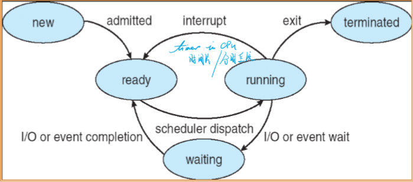
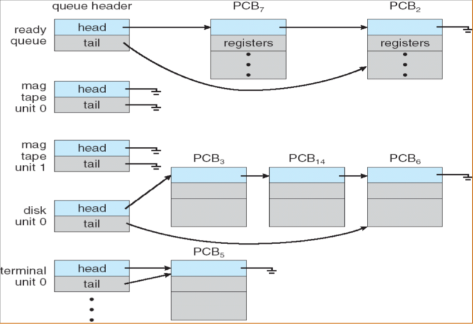

# Chapter0


# Chapter1 Introduction

### System view

*   Resource allocator
*   Control program

### Dual-Mode Operation

*   User mode
*   Kernel mode
    *   privileged instruction
    *   
    *   
*   Hardware
*   **CPU protection**
    *   **timer**
        *   **time sharing**
*   **memory protection**
    *   **Base register**
    *   **Limit register**
*   **I/O protection**
    *   **all I/O instruction are privilege instructions**

### Development of OS

*   mainframe systems

    *   NO OS
    *   **batch systems**
    *   **multiprogramming systems**
    *   **time sharing systems**

*   desktop systems

*   multiprocessor systems

*   distributed systems

*   clustered systems

*   real-time systems

*   handheld systems

*   现代操作系统的特征

    *   **并发性Concurrence**
    *   **共享性Sharing**
    *   **虚拟性Virtual**
    *   **异步性Asynchronism**
    *   提高CPU利用率，充分发挥并发性：**程序之间、设备之间、设备与CPU之间**均**并发工作**

*   Pr：

    批处理系统、多道程序系统和分时系统的技术特性

# Chapter2 Operating-System Structures

*   功能和服务的差别：
    *   对内：自行实现
    *   对外：可以调用其他功能代为实现
*   common function of OS
    *   process management
        *   process synchronization
        *   process communication
        *   deadlock handling
        *   (分布式)
    *   main memory management
    *   secondary-storage management
    *   file management
    *   I/O system management
*   Operating System Services(Services for **helping users**)
    *   Program execution
    *   I/O operations
    *   File-system manipulation
    *   Communications
    *   Error detection
    *   Resource allocation
    *   Accounting(审计)
    *   Protection
*   Operating System Interface
    *   Interface to programs
        *   **System calls**
            *   System-call interface(SCI)
            *   Application Programming Interface(API)
                *   managed by runtime support library
        *   
        *   
            *   Types of System calls
                *   Process control
                *   File management
                *   Device management
                *   Information maintenance
                *   Communications
    *   **PR. Why do user use APIs rather than system calls directory?**
        1.  跨平台能力（提供相同的API封装）移植性好
        2.  模块化封装，可维护性好
        3.  简化了程序编写
        4.  提高了执行效率
*   Operating System Structure
    *   Simple structure
    *   Layered structure
        *   virtual machines
    *   Microkernel structure
        *   Benefis
            *   easier to extend
            *   easier to port
            *   more reliable
            *   more secure
    *   Modules
    *   PR:设计操作系统时采用的模块化内核方法和分层方法在那些方面类似？那些方面不同？
*   Operating system design and implementation
*   小结
    *   操作系统概念（管理资源、支持程序运行、方便用户使用的**程序集**）
    *   操作系统的基本目标：**方便性和高效性**
    *   引导程序：**中断、中断处理程序、中断向量**
    *   储存结构：内存（**小、易失**）二级储存（**大、非易失**）、分层结构
    *   I/O结构：设备控制器（本地缓冲）、DMA
    *   硬件保护：**双重模式操作、特权指令、I/O保护、内存保护、CPU保护**
    *   操作系统的发展：e.g: 多道程序设计
    *   操作系统的功能：进程（CPU）管理、内存管理、磁盘管理、文件管理、I/O管理、**用户接口**
    *   操作系统服务：**程序执行、I/O操作、文件系统操作、通信、错误检测与处理**、资源分配、统计、保护
    *   操作系统接口：用户接口（CLI、GUI）、程序接口（**系统调用（参数传递、类型）**）、SCI、API
    *   操作系统结构

# Chapter03 Process

*   Process 

    *   test section(program code)
    *   **program counter**
    *   **contents of the processer's registers**
    *   Heap-stack
    *   data section
    *   
    *   
    *   **Characteristic of process**
        *   **Dynamic动态性**
        *   **Independency独立性**
        *   **Concurrence并发性**
        *   **Structure结构化**
    *   PR.进程和程序是两个密切相关的概念，请阐述他们之间的区别和联系
    *   Process state
    *   
    *   
    *   Process control block(PCB)
    *   
    *   

*   Process scheduling queues

    *   Job queue (in main memory)
        *   Ready queue 
        *   device queues
            *   process migration between the various queues
            *   
            *   
            *   
            *   
        *   Schedulers
            *   Long-term scheduler(秒级、分钟级，作业调度)
            *   Short-term scheduler(毫秒级，CPU调度)
            *   Medium-term scheduler(swapping)
        *   I/O bound process
        *   CPU bound process
        *   Context switch
            *   The **context** of a process is represented in **PCB** of the process and includes the values of CPU registers.
            *   保存执行后的上下文信息
            *   上下文切换会带来开销
            *   尽量减少上下文切换以减少开销
            *   
            *   

*   Operation on Process

    *   Process creation
        *   child process(unique process identifier(int)), tree of process

*   Interprocess Communication

*   Communication in Client-Server System

    ```
    正在更(hua)新(shui)中...
    _   _       ___   __   _  __    __  _   _   _   _  
    | | | |     /   | |  \ | | \ \  / / | | | | | | | | 
    | |_| |    / /| | |   \| |  \ \/ /  | | | | | | | | 
    |  _  |   / / | | | |\   |   \  /   | | | | | | | | 
    | | | |  / /  | | | | \  |   / /    | |_| | | |_| | 
    |_| |_| /_/   |_| |_|  \_|  /_/     \_____/ \_____/ 
    ```

    


​		