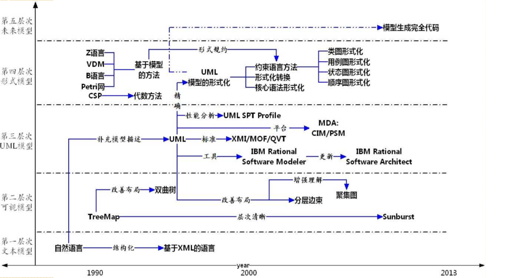

[TOC]

# Chapter 1 概述

-   软件架构产生的背景
    -   软件危机
        -   根源
            1.  软件复杂易变，行为特性难于预见，需求向设计缺乏有效的转换导致开发过程中的困难和不可控
            2.  随着软件体系规模越来越大越来越复杂，整个系统的贵和和规格说明越来越重要
            3.  对于大规模复杂软件系统，总体的系统结构设计和规格说明非常重要
            4.  对软件体系的结构的研究有望成为提升软件生产率和解决软件维护问题的有效途径之一
        -   软件架构
            -   作用
-   **软件架构的思想和特征**
    -   **主要思想**
        -   **软件架构是一个系统软件的设计图，不仅限于软件系统的总体结构，还包含一些质量属性以及功能与结构之间的映射关系，即设计决策**
        -   **软件架构的两个主要焦点集中于系统的总体结构以及需求和实现之间的对应**
        -   **主要思想是将注意力集中在系统总体结构的组织上**
        -   **筛选按手段是运用抽象方法屏蔽模块间的连接，是人们的认知提升并保持在整体结构的部件的交互层次，并进一步将交互从计算中分离出来，建立“组件+连接件+配置”的软件系统高层结构组织方式**
    -   **特征**
        1.  **注重可重用性——组件及架构及重用**
        2.  **利益相关者多——平衡需求**
        3.  **关注点分离——模块化、分治**
        4.  **质量驱动——关注非功能属性**
        5.  **提倡概念完整性——强调设计结构是一个持续的过程**
        6.  **循环风格——用标准方法来处理反复出现的问题**
-   软件架构的发展阶段，各阶段特征
    -   1968-1994 基础研究阶段
        -   1968 NATO 软件架构概念提出
        -   模块化实践
            -   高内聚低耦合
            -   模块大小适度
            -   模块链调用深度不可过多
            -   接口干净，信息隐藏
            -   尽可能地复用已有模块（功能独立）
    -   1991-2000 概念体系和核心技术形成阶段
        -   组件技术（component）
    -   1996-1999 理论体系丰富发展阶段
        -   软件架构的描述与表述
        -   软件架构分析、设计与测试
        -   软件架构发现、演化与重用
        -   基于软件架构的开发方法
        -   软件架构的风格
        -   etc..
    -   1999-至今 理论完善和普及应用阶段
-   软件架构研究和应用现状

# chapher 2 软件架构概念

-   软件架构定义
    -   一研究人员一般认为
    -   软件架构就是一个系统的草图
-   **组成派定义**
    -   **组成派关注于软件本身，将软件架构看作构件和交互的集合**
-   **决策派定义**
    -   **决策派关注于软件架构中的实体（人），将软件架构视为一系列重要设计决策的集合**
-   **参考框架定义**（一般性定义）：
    -   **组件component**
        -   **角色role**
    -   **连接件connector**
        -   **端口port**
    -   **配置configuration**

# chapter 3 软件架构模型

-   软件架构模型是什么

    -   软件架构建模是对架构设计决策的具象化和文档化

-   **软件架构建模的五类方法**
    -   **基于非规范图形表示的建模方法**
    
        >   基于图形可视化建模方法
        >
        >   -   非正式图形表示
        >       -   盒线图
        >       -   etc.
        >   -   正式图形表示
        >       -   树形结构
        >       -   树地图
        >       -   改进的树地图
        >       -   旭日图
        >       -   双曲树
    
    -   **基于UML的建模方法**
    
        -   逻辑视图
        -   开发视图
        -   过程视图
        -   物理视图
        -   优点
            -   统一标准
            -   支持多视图结构
            -   模型操作工具
            -   统一的交叉引用
    
    -   **基于形式化的方法**
    
    -   **基于UML形式化的方法**
    
        ```mermaid
        graph LR
        A[需求分析]-->B[需求文档规格说明]
        B-->C[UML建模]
        C-->D[形式化描述和验证]
        D-->E[程序编码]
        E-->F[形式规范自动生成和测试变量]
        F-->G[软件产品]
        ```
    
        >   需求分析到形式化描述和验证占全部工作量的60%~70%
    
-   **软件架构建模方法的发展趋势**

    

    

    -   第一层次
      
        -   文本模型
    -   第二层次
      
        -   图形可视化模型
    -   第三层次
      
    -   UML模型
    -   第四层次
    
    -   形式化模型
    
    -   第五层次
    
        -   未来模型
    
        

# Chapter 4 软件架构风格和模式

-   **什么是软件架构风格/软件架构惯用模式**

    -   **描述特定应用领域中系统组织方式的惯用模式**

-   使用架构风格的好处

    -   作为“可复用的组织模式和习语”，为设计人员的交流提供了公共的术语空间，促进了设计复用和代码复用
    -   极大地促进了设计的重用性和代码的重用性，并且使得系统的组织结构易被理解
    -   使用标准的架构风格可较好地支持系统内部的互操作性以及针对特定风格的分析

-   **经典体系结构风格的特点、优点、缺点、适用范围**
  
    >   数据流风格 加一个批处理序列
    
    1.  **管道过滤器风格**
        -   特点
            -   过滤器是独立运行的部件
            -   过滤器无法感知其处理上下连接的过滤器
            -   结果的正确性不依赖与各个过滤器运行的先后次序
        -   优点
            -   每个组件行为不受其他组件的影响，整个系统的行为易于理解
            -   管道-过滤器风格支持功能模块的复用
            -   基于管道-过滤器风格的系统具有较强的可维护性和可扩展性
            -   支持一些特定的分析（e.g.吞吐量计算和死锁检测）
            -   管道-过滤器风格具有并发性
        -   缺点
            -   管道-过滤器风格往往导致系统处理过程的成批操纵
            -   对加密数据流需要在每个模块中进行解析或反解析，增加了过滤器实现的复杂性
            -   交互处理能力弱
    ---
    >   调用返回风格
    
    2.  **主程序/子程序风格**
        -   特点
            -   从功能观点设计系统，通过逐步分解和逐步细化得到系统架构，
            -   主程序的正确性依赖与它调用的子程序的正确性
            -   组件为主程序和子程序
            -   连接件为调用-返回机制
            -   拓补结构为层次化结构
        -   优点
            -   具有很高的数据访问效率（计算共享一个储存区）
            -   不同的计算功能被划分在不同的模块中
        -   缺点
            -   对数据储存格式的变化将会影响几乎所有的模块
            -   对处理流程的改变与系统功能的增强适应性较差
            -   这种分解方案难以支持有效的复用
    3.  **面向对象风格**
        -   特点
            -   对象负责维护其表示的完整性
            -   对象的表示对其他对象而言是隐蔽的
        -   优点
            -   对象隐藏了其实现细节、可以在不影响其他对象的情况下改变对象的实现，不仅使得对象的使用变得简单、方便，而且具有很高的安全性和可靠性
            -   设计者可将一些数据存取操作的问题分解成一些交互代理程序的集合
        -   缺点
            -   当一个对象和其他对象通过过程调用等方式进行交互时，必须知道其他对象的标识。无论何时改变对象的标识，都必须修改所有显示调用它的其他对象，并消除由此带来的一些副作用
    4.  **层次化风格**
    
    ---
    
    >   独立组件风格
    
    5.  **事件驱动风格**
    
    ---
    
    >   虚拟机风格
    
    6.  **解释器风格**
    
    7.  **基于规则的系统风格**
    
    ---
    
    >   仓库风格
    
    8.  **仓库风格**
    
    9.  **黑板系统风格**
    
    ---
    
    >   其他
    
    10.  **C2风格**
    
    11.  **客户机/服务器风格**
    
    12.  **浏览器/服务器风格**
    
    13.  **平台/插件风格**
    
    14.  **面向Agent风格**
    
    15.  **面向方面软件架构风格**
    
    16.  **面向服务架构风格**
    
    17.  **正交架构风格**
    
    18.  **异构风格**
    
    19.  **基于层次消息总线的架构风格**
    
    20.  **模型-视图-控制器风格**

# Chapter 5 架构描述语言

-   什么是软件架构描述语言
-   **为何有多种软件架构描述语言**
-   ADL的核心设计元素
    -   组件
    -   连接件
    -   架构配置
    -   约束条件

# Chapter 6 软件架构与敏捷开发

-   敏捷开发的基本理念
-   敏捷开发与架构的设计的关系
-   敏捷开发中如何改变了软件架构的设计方式
-   两类常见敏捷架构设计方法
    -   规划式设计和演进式设计，具体体现为初始化阶段设计和迭代过程中的设计

# Chapter 7 架构驱动的软件开发

-   **架构驱动的软件开发步骤**和开发流程
-   **质量场景**、质量模型
-   架构的结构

# Chapter 8 软件架构建模方法

-   **成功的软件架构应具有的品质**
-   **将软件架构的概念和原则引入软件需求阶段有什么好处？不引入可能会引起什么问题？**
-   软件架构和软件需求是如何协同演化的？
-   将软件架构映射到详细设计经常遇到什么问题？如何解决？
-   **MDA的基本思想，应用MDA的好处**
-   架构设计原则

# Chapter 15 软件架构评估方法

-   软件架构评估的必要性

-   软件架构评估的方式分类

    质量属性、（质量）场景<small>基于场景的评估</small>

-   体系结构权衡分析方法（ATAM）的相关概念、评估过程（步骤）、优缺点

-   软件体系结构分析方法（SAAM）的评估过程（步骤）、优缺点（敏感点、权衡点、效用树...）


# Chapter 9软件架构的演化和维护

-   软件架构演化的目的
-   软件架构演化的实施
-   **软件架构演化方式的分类**
    -   **静态演化：需求、过程**
    -   **动态演化：需求、类型、内容、技术**
-   软件架构演化原则