[toc]
# 概述

## 软件测试产生背景
  * 软件危机*

    软件的可靠性没有保障、维护费用不断上升、进度无法预测、成本增长无法控制、程序员无限增加等，形成软件开发局面失控的状态。

  * 缺陷累计放大

  * 缺陷出现原因

    * 产品说明书（主要原因）
        * 随意、易变、沟通不足
    * 设计（次要原因）
        * 随意、易变、沟通不足
    * 编码
        * 软件复杂度、进度压力、低级错误
    * 其他
        * 理解错误、测试错误

    缺乏规范化工程约束→缺陷的不断累积与放大效应

    | 阶段     | 正确需求 | 需求缺陷 | 设计缺陷 | 编码缺陷 | 未发现缺陷 |
    | -------- | -------- | -------- | -------- | -------- | ---------- |
    | 需求阶段 | √        | √        | -        | -        | -          |
    | 设计阶段 | √        | √        | √        | -        | -          |
    | 编码阶段 | √        | √        | √        | √        | -          |
    | 测试阶段 | √        | √        | √        | √        | √          |

  * 有关测试观点的正确理解

      * 软件工程

        将系统化的、严格约束的、可量化的方法应用于软件的开发、运行和维护，即将工程化应用于软件
        
## 软件测试基本概念
  * 测试定义

      * Bill Hetzelt  定义
          * 测试就是建立一种信心，认为程序能够按照预期设想运行
          * 核心思想：测试是试图验证软件是可工作的
      * Glenford J. Myers 定义
          * 测试是为发现错误而执行一个程序或系统的过程
          * 核心思想：测试是尽可能多地发现软件错误
          * 三个**重要观点**
              * 测试是为了证明程序有错，而不是证明程序无错误
              * 一个好的测试用例是在于他能发现至今未发现的错误
              * 一个成功的测试时发现了至今未发现的错误的测试
      * IEEE Std 729-1983
          * 使用人工或是自动手段来运行或测定某个系统的过程，其目的在于检验它是否满足规定的需求或是弄清预期结果与实际结果之间的差别
      * IEEE Std 610.12-1990
        	1. 在特定的条件下运行系统或构建，观察或记录结果，对系统的某些方面做出评价
         	2. 分析某个软件项已发现现存和要求的条件之差别并评价此软件项的特性

  * 测试与调试

  * 测试目的

    1. 确保软件质量

       找出软件错误和缺陷，降低软件发布后潜在错误和缺陷造成的损失；验证软件是否能满足用户需求，树立对软件的信心。

    2. 确保软件开发过程方向的正确性

       通过分析错误产生的原因帮助发现当前开发工作所采用的软件过程的缺陷，促进软件过程改进；为风险评估提供信息

  * 测试原理/原则

    1. 用户至上

       所有测试都应追溯到用户需求。最严重的错误是导致软件是导致软件无法满足的需求。测试的目标是在用户发现缺陷前找到它们。

    2. 测试是有计划的活动

       测试计划制定先于测试的执行；测试贯穿于全部软件生存周期。

    3. 缺陷出现的集群性

       80%的错误可能源于20%的模块。

    4. 测试应从“小规模”走向“大规模”

       最初测试单个程序模块，然后在集成的模块中找缺陷，最后在整个系统中找缺陷，最后在整个系统中找缺陷

    5. 穷尽测试（完全测试）不可能

       * 输入量太大
       * 输出结果太多
       * 执行路径太多
       * etc

    6. 有效的测试应由第三方独立进行

       有些测试应避免有开发人员进行

    7. 测试无法揭示所有缺陷

       测试可以报告说有缺陷存在，但没有缺陷的话却不能说明软件没有缺陷

    8. 测试的杀虫剂悖论

       潜在缺陷对已进行的测试具有免疫力

    9. 测试是有风险的行为

       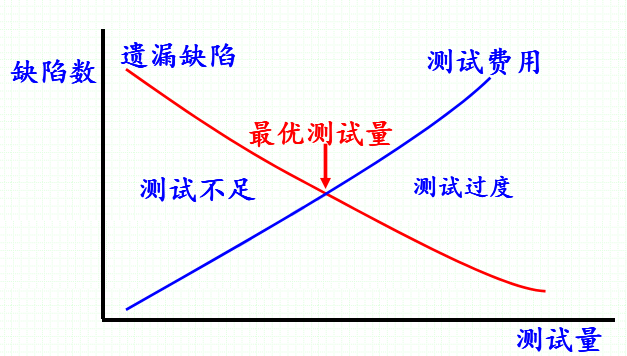

       10. 并非所有的缺陷都需要修复
           * 没有足够的时间
           * 不算真正的代码缺陷
           * 修复风险太大
           * 不值得修复
           * etc

  * 测试过程*

    1. 拟定软件的**测试计划**
    2. 编制软件测试大纲
    3. 设计和生成测试用例
       * 测试用例定义
         1. 一组输入即运行**前提条件**，和为某特定目标而生成的**预期结果**（测试用例的实质）
         2. 一个文档，详细说明**输入、期望输出**，和为一测试项所准备的一组执行条件（测试用例的一种存在方式）
       * 测试用例设计准则
         1. 代表性
            * 合理与不合理
            * 合法与非法
            * 边界和越界
            * 极限数据
            * 各种操作环境
            * etc
         2. 可判定性
         3. 可再现性
    4. 实施测试
    5. 分析测试结果（测试报告）
       1. 收集测试结果
       2. 生成测试报告

  * 测试用例（三要素）

      * 输入
      * 执行条件
      * 期望输出

  * 软件测试类型

      * v模型

          * 需求分析↘概要设计↘详细设计↘编码V单元测试↗集成测试↗系统测试↗验收测试

      * w模型

        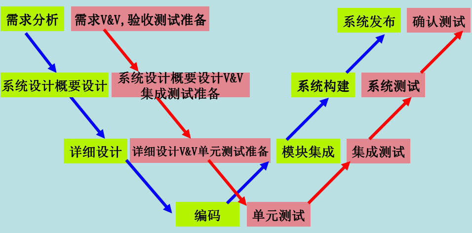

      * x模型

        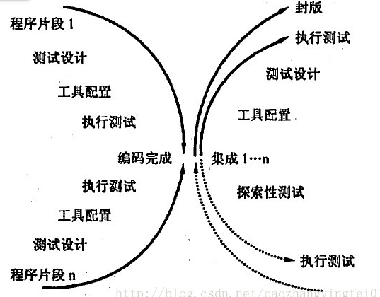

      * 前置测试模型

        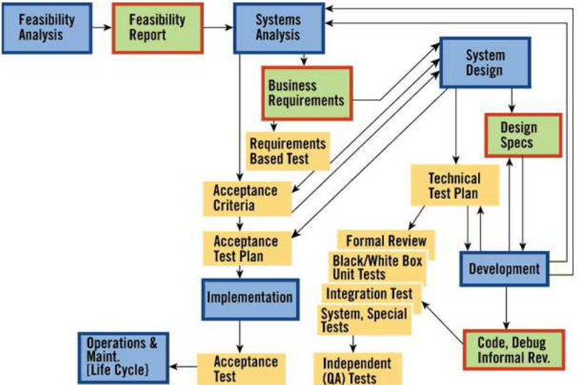

      * h模型

        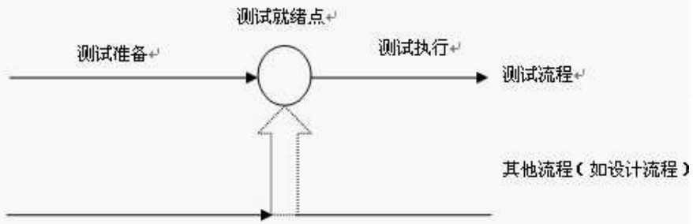

  * 软件测试w模型

## 软件测试现状和趋势

  * 软件测试的地位（工作量百分比）*

    | 阶段 | 需求分析 | 设计 | 编码 | 测试 | 运行和维护 |
    | ---- | -------- | ---- | ---- | ---- | ---------- |
    |      | 20%      | 15%  | 20%  | 45%  | -          |

    

# 白盒测试

* 静态白盒测试
  *  在不执行代码的条件下有条理地仔细审查软件设计、体系结构和代码，从而找出软件缺陷的过程，有时被称为结构化分析
    * 尽早发现软件缺陷
    * 为后继测试中设计测试用例提供思路
    
  * desk checking
  
  * Peer preview

  * walk through

  * Inspection

  * 动态白盒测试方法

    * 定义

      一种基于**源程序**或**代码**的测试方法。依据原程序或代码逻辑结构，生成测试用例以尽可能多地发现并修改源程序错误。

      白盒分为静态白盒测试和动态白盒测试
  
    * 实施者
  
    * 单元测试
      
        * 一般由开发人员进行
        
    * 集成测试
      
    * 测试人员和开发人员共同完成
      
    * 步骤
  
      * 动态
  
        1. 程序图
        2. 生成测试用例
        3. 执行测试
        4. 分析覆盖标准
        5. 判定测试结果
      
    * 静态
        * 桌面检查
        * 代码走查
        * 代码审查
        
    * 优点
  
        * 检测代码中的判断和路径
        * 解释隐藏在代码中的错误
        * 对代码的测试比较彻底
  
    * 缺点
  
        * 无法检测代码中的不可达路径
        * 不验证需求规格
  
  * 基于控制流覆盖的测试
    * 语句覆盖测试
      * 语句覆盖
        * 程序中每条**语句**都执行一次
          * 处理错误的代码片段
          * 小概率事件（恶作剧）
          * 不可达代码
          * 较为脆弱，某些严重问题
    * 条件测试
      * 判定覆盖（分支覆盖）
        * 每个**判断**取值`True`和`False`各一次
        * 优点
            * 简单，包含语句覆盖并避免了语句覆盖覆盖的问题
        * 缺点
            * 忽略了表达式内的条件，不能发现每个条件的错误
      * 条件覆盖
        * 每个**判断中的条件**的取值至少满足一次
        * 不能保证程序所有分支都被执行
      * 判定条件覆盖
      * 每个**条件和由条件组成的判断**的取值至少满足一次
        * 错误屏蔽
          * 指原子条件取值改变不会影响判定结果，因此该条件上的取值错误是不可见的。
        * 注意**短路**
    * 条件组合覆盖
        * 每个**条件的取值组合**至少出现一次
        * $2^n$（n为原子条件数），代价昂贵
        * 测试用例的约简
            * 利用短路效应寻找最小测试用例集
    * 路径测试
      * 路径覆盖
        * 优点
          * 相对彻底的测试
        * 缺点
          * 路径分支可能以指数级增加($2^n$)
          * 存在不可达路径
          * 并未测试各个分支中的条件
        * 考虑了各种判定结果的所有可能组合但是不能覆盖判定条件中结果的各种情况
        * 覆盖能力较强但是**不能**替代条件覆盖和条件组合覆盖标准
        * 覆盖程序中的**所有路径**
    
    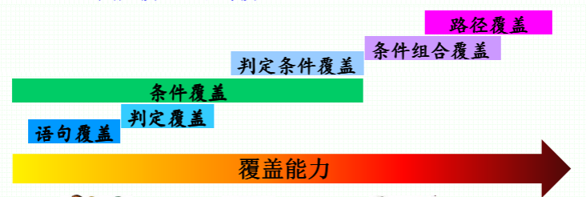
    
  * 基于控制流的测试
  
    *  基本路径测试
      *  流程图→流图→（环复杂度）→基本路径→测试用例
      
      *  **流图**用来描述程序中的逻辑控制流
        *  节点
          
          *  表示一个或多个语句
          
        *  边
          
          *  表示控制流
          
        *  域
          
          *  由边和节点限定的区间
          
        *  基本路径
        
            *  任何贯穿程序 、至少引入一组新的处理语句或一个新判断的程序通道
        
            *  环复杂度是所有语句被执行一次所需测试用例数的上限
        
                | 环复杂度 | 含义     |
                | -------- | -------- |
                | 1-10     | 良好     |
                | 11-20    | 中等     |
                | 21-50    | 复杂     |
                | >50      | 无法理解 |
        
      *  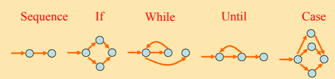
      
      *  基本路径集寻找算法
      
          1.  确认从入口到出口的最短基本路径
          2.  从入口到第一个未被先后评估为真和假两种结果的条件语句
          3.  改变该条件语句的赋值
          4.  重复步骤2-5直至所有基本路径都被找到
      
    * 循环测试
  
        * 嵌套循环
        *  先测试最内层循环
                *  按照简单循环测试
            *  由里向外，测试上层循环
                *  此层以外的所有外层循环变量取最小值
                *  此层以内所有嵌套内层循环变量取典型值
            *  重复上一条规则直至所有各层循环测试完毕
            *  对全部各层循环同时取最小循环次数或者同时取最大循环次数
        *  串接循环
            *  若串接循环的各个循环相互独立
                *  分别用简单循环测试
            *  若两个循环不独立
                *  把第一个循环看作外循环，第二个循环看作内循环，用测试嵌套循环的办法来处理
        *  非结构循环
            *  结构化再处理
  
  * 数据流测试
  
    *   数据流测试
    
        *   基本定义
    
            *   P——程序
    
            *   G(P)——程序图（流图）
    
            *   V——变量集合
    
            *   PATH(P)——P的所有路径集合
    
            *   DEF(v,n)——在节点n定义了变量v(变量**赋值**语句)
    
                *   e.g. input x; x = 2;
    
            *   USE(v,n)——在节点n使用了变量v
    
                *   e.g. print x; a = 2 + x;
    
            *   P-use——USE(v,n)，谓词使用，即条件判断语句中
    
                *   e.g. if b > 6
    
            *   C-use——USE(v,n)，运算使用，位于运算中
    
                *   e.g. x = 3 + b
    
                    >*   O-use——输出使用
                    >*   L-use——定位使用（数组）
                    >*   I-use——迭代使用（循环）
    
            *   du-path——定义-使用路径
                
                *   给定PATH(P)中的某条路径，如果定义节点DEF(v,m)为该路径的起始节点，使用节点USE(v,n)为该路径的终止节点，则该路径是v的一条du-path
            *   dc-path——定义-清除路径
            
                *   如果变量v的某个定义-使用路径，除起始节点外没有其他定义节点，则该变量路径是变量v的定义-清除路径
    
        *   数据流覆盖测试
        
            1.  对于给定的程序，构造相应的程序图
        2.  找出**所有变量**的**du-path**（可以约简）
            3.  考察测试用例对这些路径的覆盖程度
    
        *   常用覆盖标准
        
            *   Rapps和Weyuker标准
                *   All-Paths
                    *   路径覆盖
                *   All-Edges
                    *   分支覆盖
                *   All-Nodes
                    *   语句覆盖
                *   All-Defs
                    *   每个定义节点都有一条dc-path
                *   All-P-Use
                    *   每个定义节点都有一条dc-path
                *   All-P-Uses/some-C-Uses
                *   All-C-Uses/Some-P-Uses
                *   All-Users
                    *   每个变量的定义节点都有一条dc-path到达该变量的使用节点
                *   All-du-path
            *   Ntafos标准
            *   Ural标准
            *   Laski和Korel标准
## 白盒测试工具

  * 测试工具分类*
      * 静态分析工具
      * 动态分析工具
  * 测试工具的作用*
      * 提高代码效率
      * 降低测试成本
## 控制流覆盖的测试
  1. 短路问题
  2. 使用尽可能少的测试用例
  3. 测试用例要体现控制流覆盖的特点
  4. 对各个控制流覆盖标准有明确认识
       * 语句
       * 判定
       * 条件
       * 判定条件
       * 条件组合
       * 路径
  > 控制流覆盖不使用程序流图
## 基本路径测试
 1. 正确画出流程图，出自组合条件的判定
 2. 使用多种方法计算圈（环）复杂度
 3. 正确得出基本路径（顺序）
 4. 不是所有基本路径都能写出测试用例
## 数据流测试
 1. 不考虑数据流覆盖的各种标准
 2. 能够找出定义节点和使用节点
 3. 列举出所有可能的DU路径
 4. 进行DU路径约简
# 黑盒测试
  ## 黑盒测试基本概念
  * 定义*
      * 一种基于规格说明，不要求考察代码，以用户视角进行的测试
  * 意义*
      * 黑盒测试有助于软件产品的总体功能验证
          * 检查明确需求和隐含需求
          * 采用有效输入和无效输入
          * 包含用户视角
  * 目的
      * 有时无法获取程序代码
      * 尽早进行黑盒测试可以尽早发现软件功能缺陷
      * 弥补遗漏的逻辑缺陷
      * 适用于测试的各个阶段
          * 单元测试
          * 集成测试
          * 系统测试
          * 回归测试
  * 实施者
      * 专门的软件测试部门：有经验的测试人员
  * 步骤*
    1.  规格说明书
    2.  生成测试用例
    3.  执行测试
    4.  判定测试结果
  * 进入退出条件
  ## 黑盒测试方法基础
  * 基于需求的测试（RTM）*

      * 目的

          * 确认软件需求规格说明书列出的需求

      * 前提

          * 需求规格已经经过仔细评审
          * 隐含需求明确化

      * 需求规格说明样本

          * 需求规格说明

        | 序号 | 需求标识 | 需求描述 | 优先级 |
        | ---- | -------- | -------- | ------ |
        |      |          |          |        |

        *   需求跟踪矩阵样本

        | 需求标识 | 需求描述 | 优先级 | 测试条件 | 用例标识 | 测试阶段 |
        | -------- | -------- | ------ | -------- | -------- | -------- |
        |          |          |        |          |          |          |

        * 需求跟踪矩阵(RTM)
            * 作用
                * 可跟踪每个需求的测试状态而不会遗漏任何需求
                * 优先执行优先级高的测试用例，尽早发现高优先级区域内缺陷
                * 可导出特定需求对应的测试用例清单
                * 评估测试工作量和测试进度的重要数据
        * 测试执行数据样本

        | 序号 | 需求标识 | 优先级 | 测试用例 | 用例总数 | 通过用例 | 未通过用例 | 通过率 | 缺陷数 |
        | ---- | -------- | ------ | -------- | -------- | -------- | ---------- | ------ | ------ |
        |      |          |        |          |          |          |            |        |        |

        

    *   需求跟踪矩阵

        | 需求标识 | 需求描述 | 优先级 | 测试条件 | 用例标识 | 测试阶段 |
        | -------- | -------- | ------ | -------- | -------- | -------- |
        |          |          |        |          |          |          |

    *   作用

        *   可跟踪每个需求的测试状态而不会遗漏任何需求
        *   优先执行优先级高的测试用例，尽早发现高优先级区域内缺陷
        *   可导出特定需求对应的测试用例清单
        *   评估测试工作量和测试进度的重要数据

  * 正面测试*

      * 测试用例通过一组预期输出验证产品需求
      * 证明软件对于每条规格说明和期望都能通过

  * 负面测试*

      * 展示当输入非预期输入时产品没有失败
      * 使用产品没有设计和预想到的场景，尝试使系统垮掉
      * 负面测试不能映射到需求
  ## 黑盒测试方法
  * 等价划分

      * 原理
          * 将程序的输入域划分为数据类，以便导出测试用例
          * 他试图定义一个测试用例以发现各类错误，从而减少测试用例数目，降低测试工作量
      * 等价类（划分）
          * 如果软件行为对一组值来说是相同的，则称这组值为等价类
          * 产生同一个预期输出的一组输入值叫一个划分
          * 有效等价类
              * 完全满足产品规格说明的输入数据构成的集合
          * 无效等价类
              * 不满足程序输入要求或者无效的输入数据构成的集合
          * 划分类型
            1.  布尔表达式
                1.  一个有效等价类True
                2.  一个无效等价类False
            2.  范围
                1.  一个有效等价类，范围内
                2.  两个无效等价类，大于小于
            3.  数据个数
                1.  一个有效等价类，正确个数
                2.  两个无效等价类，大于小于
            4.  集合的某个子集
                1.  一个有效等价类，正确集合
                2.  若干无效等价类
            5.  一组列表形式的数据
                1.  多个有效等价类，每个输入数据为一个等价类
                2.  1个无效等价类
            6.  要求符合几个规则
                1.  多个有效等价类
                2.  若干无效等价类
        * 步骤
            1.  划分准则
            2.  确定有效等价类和无效等价类
            3.  从等价类中选取样本数据
            4.  根据需求写预期结果
            5.  加入特殊值
            6.  执行测试

  * 边界值分析

      * 软件的两个主要缺陷源

          * 条件
          * 边界

      * 边界值分析

        *   原因

            *   使用比较操作符时未仔细分析
            *   多种循环和条件检查方法引起的困惑
            *   对边界附近需求的理解不够

        *   测试边界

            *   第一个-1/最后一个+1
            *   开始-1/完成+1
            *   最小值-1/最大值+1

        *   界定边界值

            *   n存在边界值的参数个数
            *   m边界值条件个数

        *   Paul Jorgensen公式

            *   4n+1 基本边界测试

                *   min

                *   min+1

                *   max-1

                *   max

                *   一个典型值

                    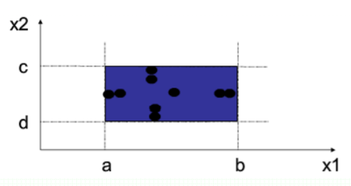

            *   6n+1 健壮性边界测试

                *   min-1

                *   min

                *   min+1

                *   max-1

                *   max

                *   max+1

                *   一个典型值

                    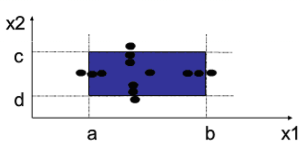

            *   3m 边界条件测试

                *   self-1
                *   self
                *   self+1

  * 因果分析法

      * 因果图
      * （需求规格说明书）→生成因果列表→（起因结果列表）→建立决策表→（决策表）→生成测试用例
      * 表示
          * 原因 $C_i$
          * 结果 $E_i$
      * 因果4种关系
          * 
          * 
          * 
          * 
      * 输入约束4种
          * 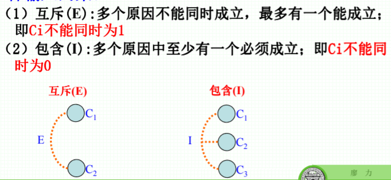
          * 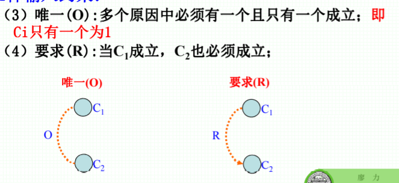
      * 输出约束1种
          * 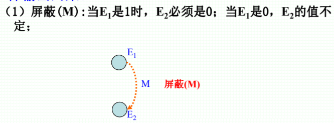
      * 决策表

    | -                | 1    | 2    | 3    | 4    | ...  |
    | ---------------- | ---- | ---- | ---- | ---- | ---- |
    | 条件C1           |      |      |      |      |      |
    | 条件C2           |      |      |      |      |      |
    | 条件Cn           |      |      |      |      |      |
    | 行动A1           |      |      |      |      |      |
    | 行动A2           |      |      |      |      |      |
    | 行动An           |      |      |      |      |      |
    | 测试用例（输出） |      |      |      |      |      |

    * Step
        1.  分析规格说明书，识别原因和结果
        2.  在因果图之间连接原因和结果
        3.  表明原因之间以及结果之间的约束条件
        4.  因果图转换为因果图列表进而生成决策表
        5.  决策表的规则转换为测试用例

* 决策表

    * 组成

        * 条件桩

            * 列出所有可能问题

        * 条件项

            * 解除条件所有可能取值

        * 动作桩

            * 列出可能采取的操作

        * 动作项

            * 在条件项的各种取值情况下应采取的动作

        * 决策规则，贯穿条件项和动作项的一列

            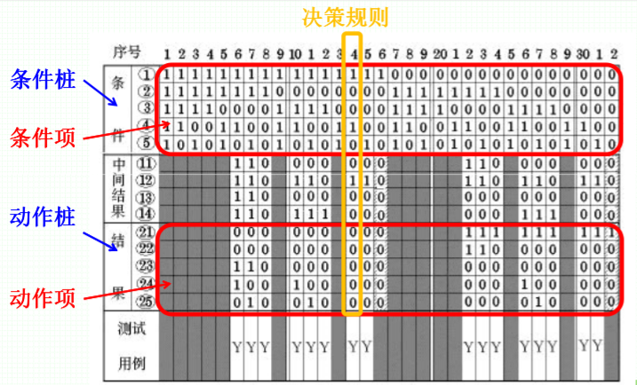

        *   构造决策表
            1.  列出所有的条件桩和条件项
            2.  填入条件项
            3.  填入动作项，得到初始决策表
            4.  简化决策表，合并相似规则
        *   化简
            *   合并相似规则

  * 基于模型的测试*

      * TODO page 2.127
      * 

  * 正交数组

  * 蜕变

  * 测试

  * 随机测试

  ## 黑盒测试工具
  * 测试工具原理
  * 作用

## 等价划分和边界值分析

1. 等价类划分一定要考虑全面，分为有效等价类和 无效等价类，并统一编号
2. 写测试用例时，每个等价类至少有一个测试用例
3. 边界值分析可考虑边界值和条件值
4. 边界值要考虑需求的限制、数据类型的限制、系统的限制等多种限制条件

## 因果图和决策表

1. 能够列出原因和结果列表
2. 因果图的画法
3. 根据因果图得出因果列表，进一步得出决策表
4. 决策表约简

# 单元测试和集成测试

## 软件测试

* 基本概念*
  * 软件单元
  * 定义
  * 意义
  * 目标
  * 实施者
  * 关注点
* 单元测试流程
  * 驱动器
  * 程序桩

## 集成测试

* 概念*
* 接口*
* 瞬时集成测试
* 增量集成测试
  * 自顶向下
  * 自底向上

## 测试插装

* 黑盒插装*
* 白盒插装*
* 插桩作用

# 系统测试、确认测试和回归测试

## 系统测试

* 概念
  * 定义
  * 意义
  * 目的
  * 实施者
* 功能测试
  * 设计/体系结构测试
  * 业务垂直测试
  * 部署测试
  * Alpha/Beta测试
  * 符合性
* 非功能测试
  * 可伸缩性测试/容量测试
  * 可靠性测试
  * 压力测试
  * 互操作性测试/兼容性测试
  * 可使用性与易获得性测试
  * 国际化测试
  * 性能测试
  * 安全性测试

## 确认测试

* 概念*
* 实施者
* 目的*

## 回归测试

* 概念*
* 组测试*
* 波及效应

