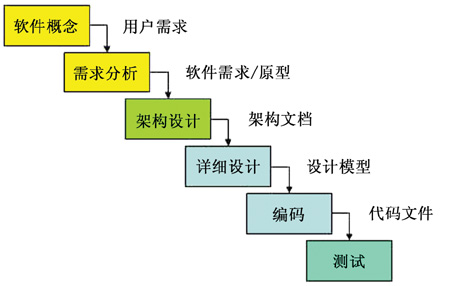
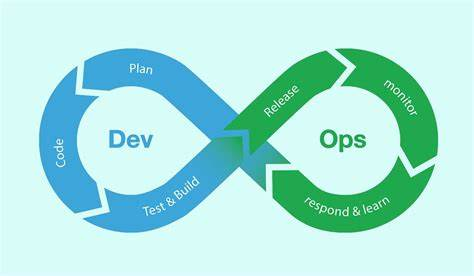
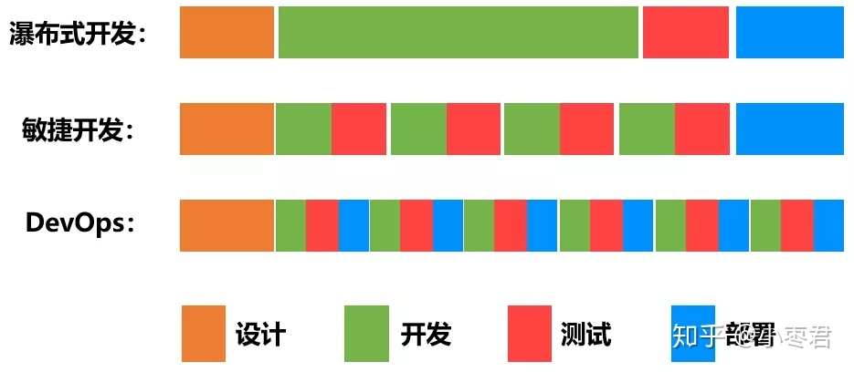

title: DevOps CICD 零基础简介和实践
date: 2020-03-01 00:00:00
tags: 
- CICD
- Github

# 关于DevOps和CICD

## 一些前置名词介绍

* **敏捷开发：**(Agile software development)是一种应对快速变化的需求的一种软件开发能力。相对于『非敏捷』，更强调程序猿团队和产品设计团队的紧密协作、面对面的沟通、频繁交付新的软件版本、紧凑而自我组织型的团队、能够更好的适应需求变化的代码编写和团队组织方法。

* **持续集成：**(Continuous Integration) 是一种软件开发实践，即团队开发人员经常集成他们的工作，通常每个成员每天至少集成一次，也就意味着每天可能会发生多次集成。每次的集成都通过自动化的构建（包括编译、发布、自动化测试）来验证

* **持续部署：**(Continuous Deployment) 通过自动化的构建、测试和部署循环来快速交付高质量的产品。某种程度上代表了一个开发团队工程化的程度。

* **持续交付：**(Continuous Delivery:CD) 让软件的产出过程在一个短周期内完成，以保证软件可以稳定、持续的保持在随时可以释出的状态。它的目标在于让软件的建制、测试与释放变的更快以及更频繁。这种方式可以减少软件开发的成本与时间，减少风险。

# 为什么需要DevOps?

* 传统软件开发流程：
  * 规划→编码→构建→测试→发布→部署→维护
  * 开发
    * 规划、编码和构建
  * 测试
    * 测试
  * 运维
    * 发布、部署和维护
  * 早期的软件交付模型：瀑布模型（Waterfall）模型
  * 
  * 缺点
    * 反应迟缓、流程越往后走更改需求带来的额外成本急速上升

* DevOps

  

  * Development & Operations
  * DevOps是一组过程、方法与系统的统称，用于促进**开发**、**技术运营**和**质量保障（QA）**部门之间的沟通、协作与整合。
  * 

  * 从目标来看，DevOps就是让开发人员和运维人员更好地沟通合作，通过自动化流程来使得软件整体过程更加快捷和可靠。

  * 在DevOps的流程下，运维人员会在项目开发期间就介入到开发过程中，了解开发人员使用的系统架构和技术路线，从而制定适当的运维方案。而开发人员也会在运维的初期参与到系统部署中，并提供系统部署的优化建议。

  * DevOps的实施，促进开发和运维人员的沟通，增进彼此的理解。

  * 

    

    

# CICD实践：以GitHub action平台为例

## Getting started with a workflow

To help you get started, this guide shows you some basic examples. For the full GitHub Actions documentation on workflows, see "[Configuring workflows](https://help.github.com/articles/configuring-workflows)."

### Customizing when workflow runs are triggered

- Set your workflow to run on push events to the `master` and `release/*` branches

  ```
  on:
    push:
      branches:
      - master
      - release/*
  ```

- Set your workflow to run on `pull_request` events that target the `master` branch

  ```
  on:
    pull_request:
      branches:
      - master
  ```

- Set your workflow to run every day of the week from Monday to Friday at 2:00 UTC

  ```
  on:
    schedule:
    - cron: "0 2 * * 1-5"
  ```

For more information, see "[Events that trigger workflows](https://help.github.com/articles/events-that-trigger-workflows)."

### Running your jobs on different operating systems

GitHub Actions provides hosted runners for Linux, Windows, and macOS.

To set the operating system for your job, specify the operating system using `runs-on`:

```
jobs:
  my_job:
    name: deploy to staging
    runs-on: ubuntu-18.04
```

The available virtual machine types are:

- `ubuntu-latest`, `ubuntu-18.04`, or `ubuntu-16.04`
- `windows-latest`, `windows-2019`, or `windows-2016`
- `macOS-latest` or `macOS-10.14`

For more information, see "[Virtual environments for GitHub Actions](https://help.github.com/articles/virtual-environments-for-github-actions)."

### Using an action

Actions are reusable units of code that can be built and distributed by anyone on GitHub. You can find a variety of actions in [GitHub Marketplace](https://github.com/marketplace?type=actions), and also in the official [Actions repository](https://github.com/actions/).

To use an action, you must specify the repository that contains the action. We also recommend that you specify a Git tag to ensure you are using a released version of the action.

```
- name: Setup Node
  uses: actions/setup-node@v1
  with:
    node-version: '10.x'
```

For more information, see "[Workflow syntax for GitHub Actions](https://help.github.com/articles/workflow-syntax-for-github-actions#jobsjob_idstepsuses)."

### Running a command

You can run commands on the job's virtual machine.

```
- name: Install Dependencies
  run: npm install
```

For more information, see "[Workflow syntax for GitHub Actions](https://help.github.com/articles/workflow-syntax-for-github-actions#jobsjob_idstepsrun)."

### Running a job across a matrix of operating systems and runtime versions

You can automatically run a job across a set of different values, such as different versions of code libraries or operating systems.

For example, this job uses a matrix strategy to run across 3 versions of Node and 3 operating systems:

```
jobs:
  test:
    name: Test on node ${{ matrix.node_version }} and ${{ matrix.os }}
    runs-on: ${{ matrix.os }}
    strategy:
      matrix:
        node_version: ['8', '10', '12']
        os: [ubuntu-latest, windows-latest, macOS-latest]

    steps:
    - uses: actions/checkout@v1
    - name: Use Node.js ${{ matrix.node_version }}
      uses: actions/setup-node@v1
      with:
        node-version: ${{ matrix.node_version }}

    - name: npm install, build and test
      run: |
        npm install
        npm run build --if-present
        npm test
```

For more information, see "[Workflow syntax for GitHub Actions](https://help.github.com/articles/workflow-syntax-for-github-actions#jobsjob_idstrategy)."

### Running steps or jobs conditionally

GitHub Actions supports conditions on steps and jobs using data present in your workflow context.

For example, to run a step only as part of a push and not in a pull_request, you can specify a condition in the `if:` property based on the event name:

```
steps:
- run: npm publish
  if: github.event == 'push'
```

# Reference

* https://zhuanlan.zhihu.com/p/34291715
* https://zhuanlan.zhihu.com/p/91371659

