# 数据结构 Authored [YUZEHONG](https://github.com/SEU-YUZEHONG)
## 静态哈希（Static hashing）
>数据储存在哈希表（ht）中
1. ht被分为b个桶（bucket），储存在线性数据结构中，b相当于地址
2. 每一个桶有s个扩展快（slot），通常$s=1$
3. 每一组数据在哈希表的位置由哈希函数确定$h(k)$,$h(k)\in {0,1,2,3 ...}$
>关键字密度和装载密度
1. T是所有可能关键字的数目
2. n是哈希表中已经储存的数据
3. 关键字密度为 $n/T$
4. 哈希表中的装载密度是 $n/(sb)$
>冲突，溢出和同义
1. 冲突(collision)表示新数据要存入的桶不是空的
2. 溢出(overflow)表示新数据要存入的桶中是满的
3. 同义(synonyms)表示两个关键字求得的哈希值是相同的，即$h(k_1)=k(k_2)$
4. $s=1$时，冲突和溢出是等价的
## 哈希函数(Hash Functions)
>如果$k$是一个任意的可行的关键字，并且他出现在任意桶中的概率是相同，即$h(k)=i$(i出现的概率为$1/b$)，那么这个哈希函数$h(k)$是一个规格化的哈希函数


>哈希函数取法
1. 取余(Divison)
   $h(k)=k$ $D b=D$
2. 平方取中法(Mid-Square)
   这个方法是先取关键字的平方，然后根据可使用空间的大小，选取平方数是中间几位为哈希地址。
   例如,若设哈希表长为1000，则可取关键字平方值的中间三位
   关键字|关键字的平方|哈希函数值
   --|:--:|--:
   1234|1522756|227
   2143|4592449|924
   4132|17073424|734
3. 折叠法(Folding)
   所谓折叠法是将关键字分割成位数相同的几部分（最后一部分的位数可以不同），然后取这几部分的叠加和（舍去进位），这方法称为折叠法。这种方法适用于关键字位数较多，而且关键字中每一位上数字分布大致均匀的情况。

   有两种叠加方法：1. 移位叠加 2. 边界叠加。下面将举例说明
   例如，$k=12320324111220$被分为许多个部分，每一部分为3个十进制数
   $P_1=123,P_2=203,P_3=241,P_4=112,P_5=20$
   * 移位叠加
   $h(k)=123+203+241+112+20=699$
   * 边界叠加
   $h(k)=123+302+241+211+20=897$
4. 数字分析(Digit Analysis)
   分析一组数据，比如一组员工的出生年月日，这时我们发现出生年月日的前几位数字大体相 同，这样的话，出现冲突的几率就会很大，但是我们发现年月日的后几位表示月份和具体日期的数字差别很大，如果用后面的数字来构成散列地址，则冲突的几率会 明显降低。因此数字分析法就是找出数字的规律，尽可能利用这些数据来构造冲突几率较低的散列地址。
>哈希溢出控制
1. 开放选址法
   这种方法也称再散列法，其基本思想是：当关键字key的哈希地址$p=h(key)$出现冲突时，以$p$为基础，产生另一个哈希地址$p1$，如果$p1$仍然冲突，再以$p$为基础，产生另一个哈希地址$p2，…，$直到找出一个不冲突的哈希地址$pi$ ，将相应元素存入其中。
   1. 计算$h(k)$
   2. 检验$ht[h(k)], h[h(k)+1\%b],.., ht[h(k)+j\%b]$,直到一下情况发生
      1. $ht[h(k)+j\%b]$的关键字为k
      2. $ht[h(k)+j\%b]$内没有数据
      3. 返回到起始点，退出
    ``` cpp
    template <class K, class E>
    pair<K, E>* LinearProbing<K, E>::Get(const K& k)
    { // search the linear probing hash table ht (s=1) for k.
    // If found return a pointer to the pair, else return 0.
    int i=h(k); // home bucket
    int j;
    for (j=i; ht[j] && ht[j]∈first !=k;) {
    j = (j+1) % b; // treat the table as circular
    if ( j == i ) return 0; // back to the start point
    }
    if (ht[j]∈first==k) return ht[j];
    return 0;
    }
    ```
2. 链表选址法(Chaining)
   相较与开方选址法，这里每一个桶都是一条可扩展的链
3. 比较
   1. 链表选址法(Chaining)优于开放选址法
   2. 除法取余法优于其他的哈希函数
## B树
> 多路搜索树(Multiway Search Trees), 下面讨论的都是m路搜索树
1. 一个根节点最多有m个子树以及有如下结构
   $n,A_0,(E_1,A_1),(E_2,A_2) \cdot\cdot \cdot(E_n,A_n)$
2. 关键字的值按从下到大排列
3. 子树也是m路搜索树
4. 一棵树的度数为m，树高为h，那么整棵树的最大节点树为
   $\sum_{0\leq i\leq n-1}m_i=\frac{m^n-1}{m-1}$
   并且由于一个节点最多可以有m-1个数据，因此，整棵树最多有$m^n-1$个数据


>B树的定义以及属性
一棵特殊平衡的m路搜索树就是B树
1. 根节点至少有两个子节点
2. 除了根节点和外部节点以外的所有子节点至少有$\lceil\frac{m}{2}\rceil$个子节点
3. 所有外部节点都在同一层
注意，二阶B树就是满二叉树
4. N个关键值对应N+1个外部节点,因此$N\geq 2 \lceil\frac{m}{2}\rceil^2-1 , l\geq 1$,$l\leq log_{\lceil\frac{m}{2}\rceil}{\frac{N+1}{2}}+1$
## B树插入
1. 当树为空树，直接插入。

2.  如果插入后的叶子节点的关键字的个数小于M-1，直接插入。

3. 如果插入后的叶子节点的关键字的个数为M，需分裂。

>怎样分裂

新创建一个节点，把节点从中间到后面的关键字和指针拷贝到新节点中，把中间的关键字插入到父节点中，把新创建的节点连接到父节点上，如果父节点的关键字的个数为M，则继续调整，否则停止。中间节点即$\lceil \frac{m}{2}\rceil$\
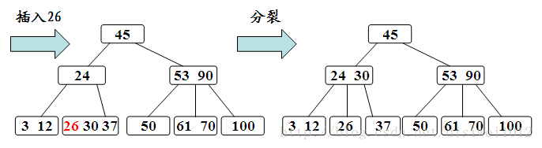
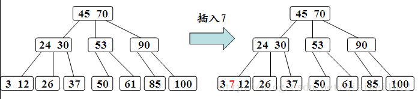
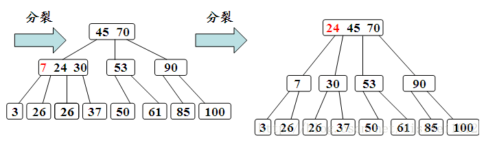






## B树删除
>如果要求删除关键字不在叶子节点，先把关键字转为位叶子节点，即：用左子树最大的关键字或者右子树最小的关键字替代

>删除步骤
1. 被删关键字Ki所在结点的关键字数目不小于$\lceil \frac{m}{2} \rceil$，则只需从结点中删除Ki和相应指针Ai，树的其它部分不变
2. 被删关键字Ki所在结点的关键字数目等于$\lceil \frac{m}{2} \rceil-1$，则需调整。
3. 被删关键字Ki所在结点和其相邻兄弟结点中的的关键字数目均等于$\lceil \frac{m}{2} \rceil-1$，假设该结点有右兄弟，且其右兄弟结点地址由其双亲结点指针Ai所指。则在删除关键字之后，它所在结点的剩余关键字和指针，加上双亲结点中的关键字Ki一起，合并到Ai所指兄弟结点中（若无右兄弟，则合并到左兄弟结点中）。如果因此使双亲结点中的关键字数目少于$\lceil \frac{m}{2} \rceil-1$，则依次类推。
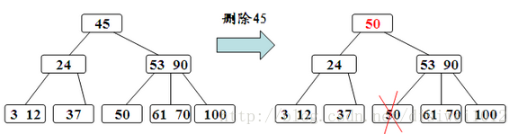

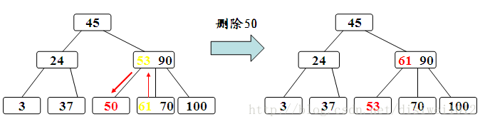

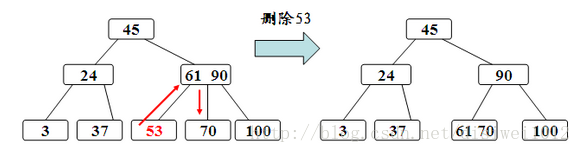

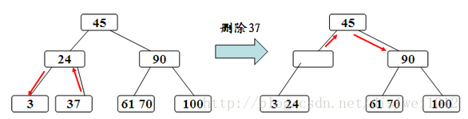

## 二叉树(Binary Tree)
>二分树的度数(Degree)为该节点的非空子树的数目
### 二叉树属性
1. 第i层的最大节点数为$2^{i-1}$
2. 深度为k的二叉树节点数为$2^{k}-1$
3. 对于任意非空二叉树，如果叶子节点为$n_0$，度数为2的节点为$n_2$，那么$n_0=N_2+1$
### 定义
1. k层的满二叉树是一个有$2^{k}-1$节点个数的树
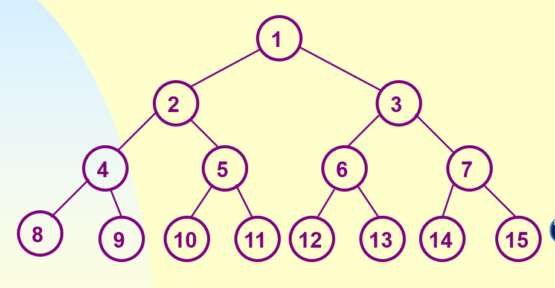

2. 完全二叉树只是满二叉树的一部分，完全二叉树的所有节点排序对应相应的满二叉树节点排序
### 二叉树的表示方法
1. 数组表示
对于任意一个下标为i的节点
   1. 它的父节点为$\lfloor \frac{i}{2} \rfloor$，i=1表示i为根节点，没有父节点
   2. 左小孩下标为$2i$
   3. 右小孩下标为$2i+1$
2. 链表表示
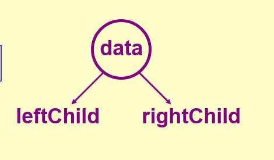

### 二叉树的遍历
>有中序遍历和其它遍历的组合都可以唯一确定一棵二叉树
1. 中序遍历
   左根右
2. 前序遍历
   根左右
3. 后序遍历\
   左右根
4. 水平遍历\
   一层一层的遍历，如下图
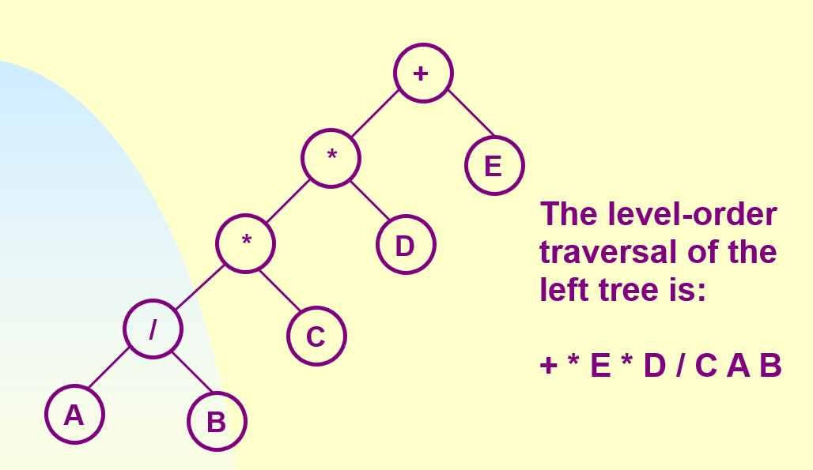

## 堆(Heap)
> 堆是一棵完全二叉树
1. 最大堆表示该堆中每个节点的值都比它的子节点大
2. 最小堆表示该堆中每个节点的值都比它的子节点小
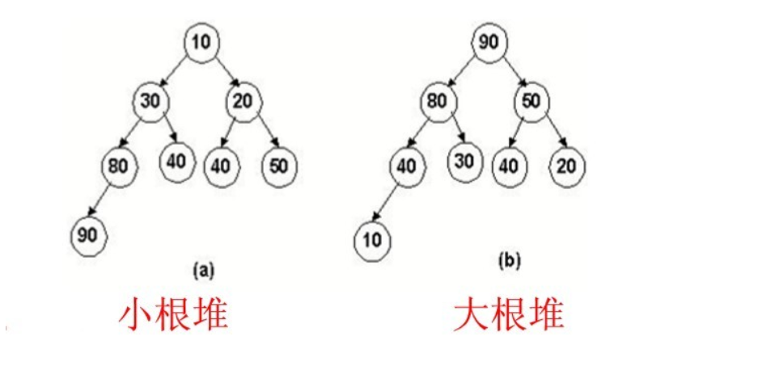

## 二叉搜索树
### 基本性质
1. 任意节点的左子树不空的话，左子树所有节点的值都比该节点的值小
2. 任意节点的右子树不空的话，右子树所有节点都大于等于该节点的值
3. 任意节点的左右子树均为二叉搜索树
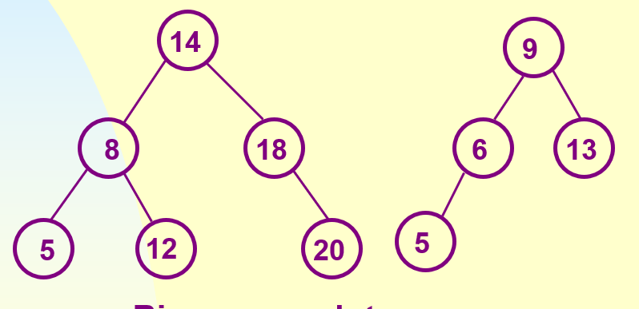

### 二叉搜索树的查找
假设去寻找关键字为k的节点
1. 如果被访问节点的关键字为k，退出
2. 如果被访问节点的关键字小于k，搜索左子树
3. 否则，搜索右子树
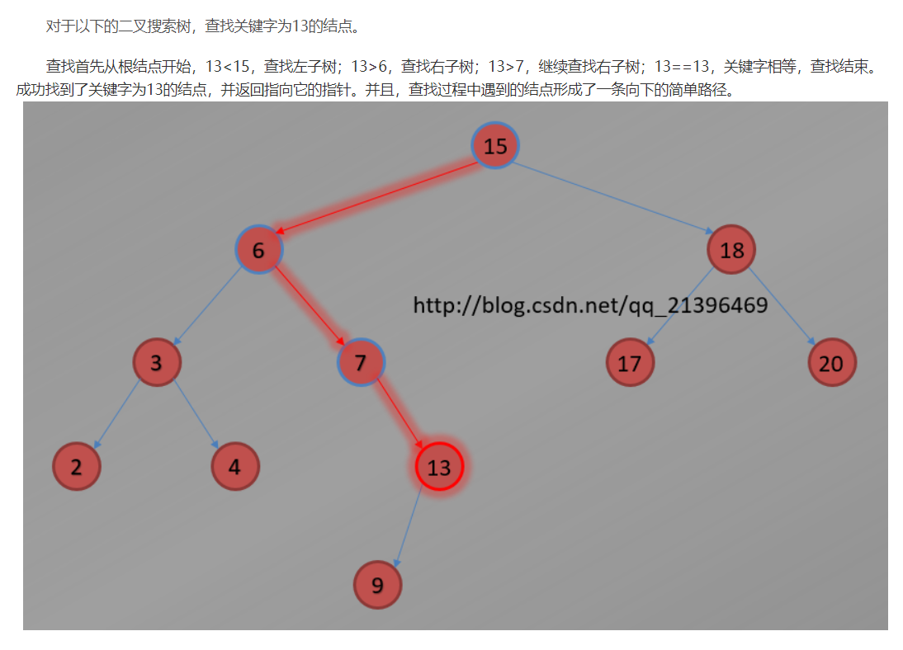

### 二叉搜索树的插入

